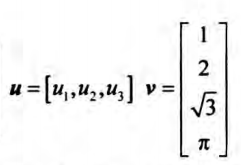  
有时候称**u**为行向量，**v**为列向量

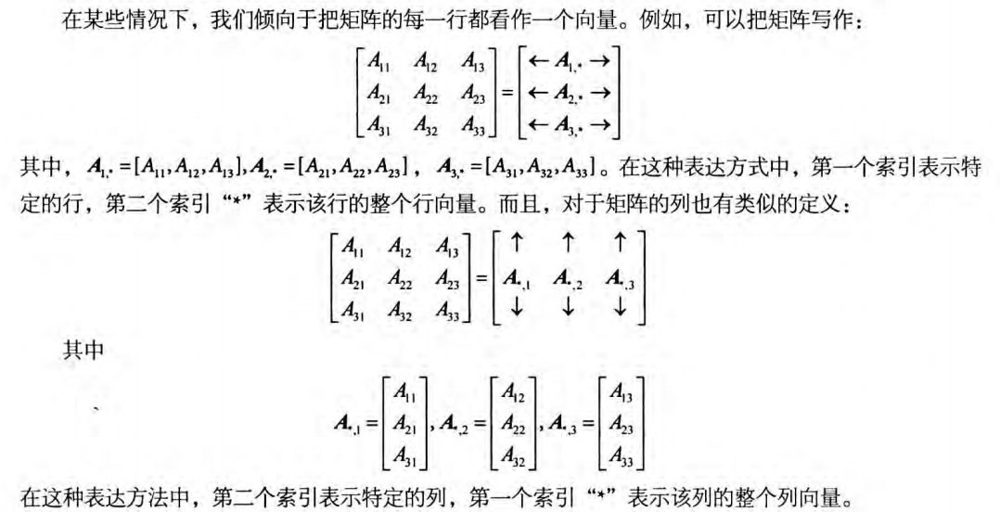  

矩阵乘法一般不满足交换律，即 **AB**≠**BA**

向量与矩阵的乘法运算：
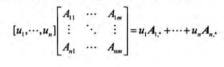  
为一种线性组合

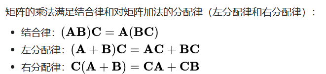  

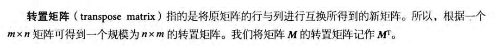  
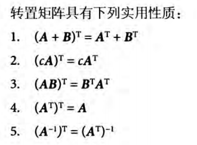  

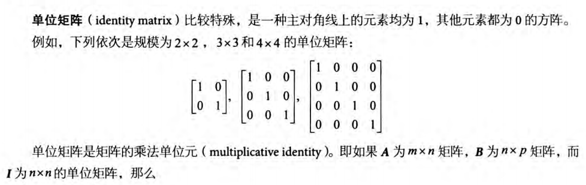  
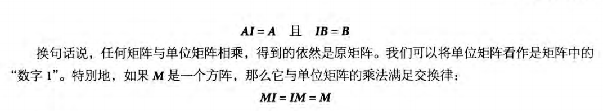  

行列式是一种特殊书的函数，它以一个方阵作为输入，并输出一个实数，方阵**A**的行列式通常表示为det **A**

当且仅当det **A**≠0时，矩阵**A**可逆

余子阵的定义  
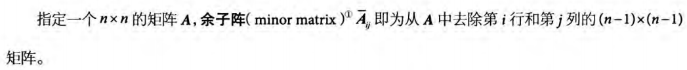  

行列式的定义  
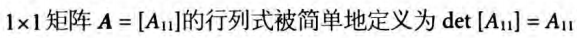  
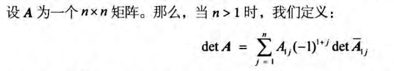  

伴随矩阵的定义
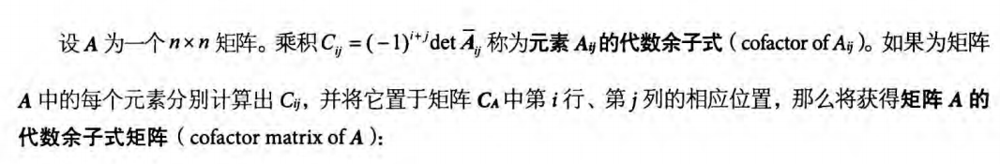  
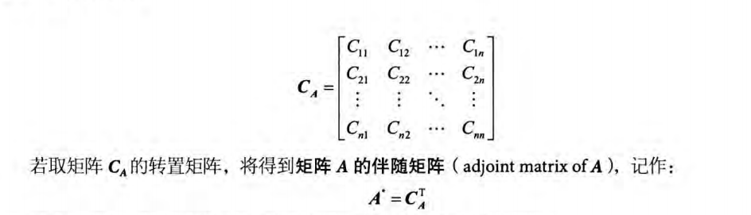  

逆矩阵
* 只有方阵才有逆矩阵，并且不是每个方阵都有逆矩阵，存在逆矩阵的方阵称为可逆矩阵，不存在逆矩阵的方阵称作奇异矩阵，矩阵与逆矩阵相乘得到单位矩阵

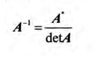  
矩阵乘积的逆  
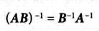  

DirectXMath以定义在`DirectXMath.h`头文件中的`XMMATRIX`类来表示4x4矩阵

[DirectXMath文档](https://learn.microsoft.com/en-us/windows/win32/api/_dxmath/)

构造函数
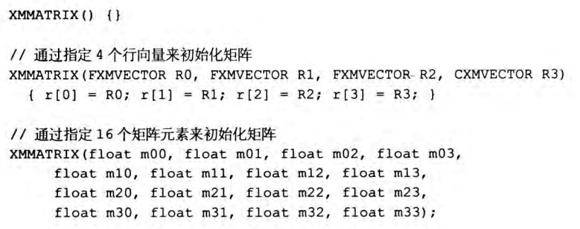  
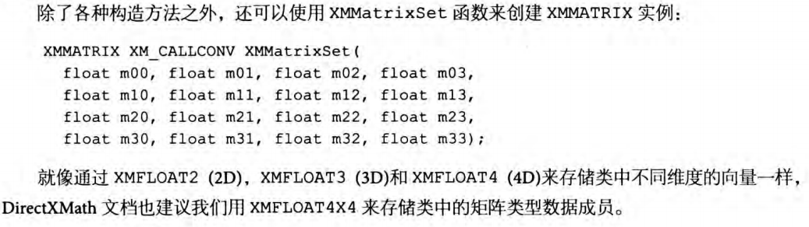  
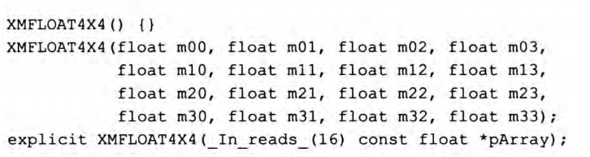  
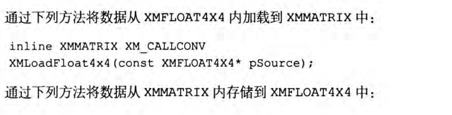  
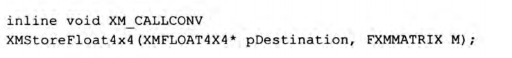  

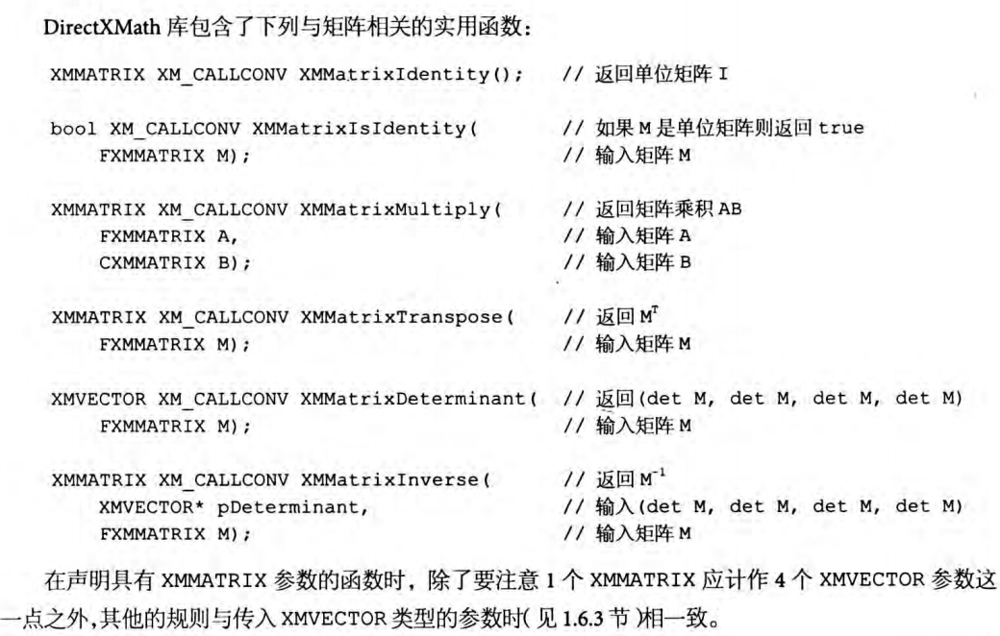  

假设传入函数的XMVECTOR参数不超过两个，则第一个XMMATRIX参数应当为FXMMATRIX类型，其余的XMMATRIX参数应为CXMMATRIX类型

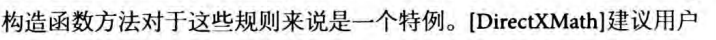  
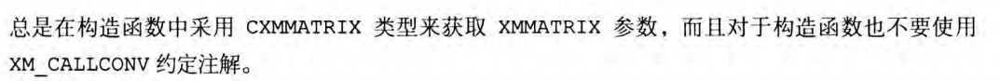  

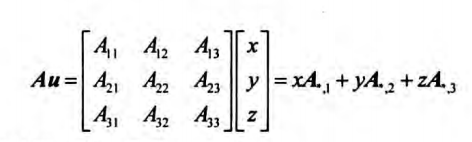   