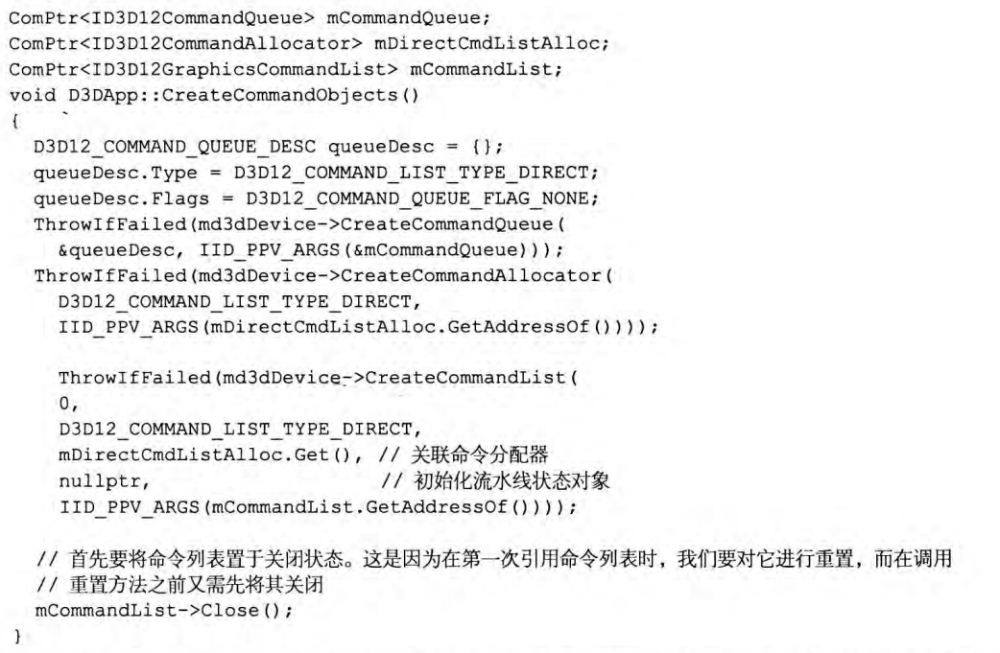

## 预备知识

表面（surface，不要与“物体表面”混淆）这一术语表示显存（尽管表面也可位于系统内存，但这里通常指代的是显存端）

### 组件对象模型
要获取指向某COM接口的指针，需借助特定函数或另一COM接口的方法。  
另外COM对象会统计其引用计数；因此，在使用完某接口时，我们便应调用它的Release方法。  
为了辅助用户管理COM对象的生命周期，WIndows运行时库（Windows Runtime Library，WRL）专门为此提供了Microsoft::WRL::Comptr类（#include<wrl.h>），可作为COM对象的智能指针使用。常用的三个Comptr方法
  
COM接口都以大写字母“I”作为开头

### 纹理格式
2D纹理（2D texture）是一种由数据元素构成的矩阵（可将此“矩阵”看作2D数组）可用作存储2D图像数据（这种情况下，纹理中的每个元素存储的都是一个像素的颜色）  
1D,2D,3D纹理就相当于特定数据元素所构成的1D,2D,3D数组  
并不是任意类型的数据元素都能用于组成纹理，只能存储[DXGI_FORMAT](https://learn.microsoft.com/en-us/windows/win32/api/dxgiformat/ne-dxgiformat-dxgi_format)枚举类型中描述的特定格式的数据元素

  

### 交换链和页面翻转
为了避免动画中出现画面闪烁的线下，最好将动画帧完整地绘制在一种称为后台缓冲区的离屏纹理内.  
两种纹理缓冲区：**前台缓冲区**（front buffer）和**后台缓冲区**（back buffer）  
前后台缓冲互换的操作称为**呈现**/提交/显示（presenting）只要交换指向但钱前台缓冲区和后台缓冲区的两个指针即可实现。
  

前台缓冲区和后台缓冲区构成了**交换链**（swap chain），在Direct3D中用IDXGISwapChain接口来表示。  
使用两个缓冲区（前台和后台）的情况称为双缓冲（double buffering）  
使用三个缓冲去就叫做三重缓冲（triple buffering）
后台缓冲区是一个纹理，构成纹理的基本元素又称**纹素**（texel），常俗称为像素，但是当谈及像素和纹素的映射关系时，必须将这两个概念区分。

关于[垂直同步](https://en.wikipedia.org/wiki/Screen_tearing#Vertical_synchronization)

### 深度缓冲
深度缓冲区（depth buffer）这种纹理资源存储的并非图像数据，而是特定像素的深度信息。深度值范围[0.0,1.0]，0.0表示观察者在视锥体（view frustum）中能看到离自己最近的物体，1.0则是能看到的最远的物体。  
深度缓冲中的元素和与后台缓存区内像素呈现一一对应的关系。  
为了确定不同物体间像素的前后顺序，Direct3D采用了深度缓冲/z缓冲的技术，使用了深度缓冲物体的绘制顺序也就无关紧要了。
按照场景中的物体由远及近绘制的缺点：对大量的数据按从后至前的绘制顺序进行排序并且还涉及集合体相交的问题  

在开始渲染之前，后台缓冲区会被清理为默认颜色，深度缓冲区也将被清除为默认值——通常为1.0（即像素能够抓到的最远深度值）  
  
一个应用程序不一定要用到模板缓冲区，但是一经使用，深度缓冲区将总是与模板缓冲区如随如影，共同进退。出于这个原因，深度缓冲区叫做深度缓冲区/模板缓冲区更为得体。

### 资源与描述符
  
  
描述符：指定资源数据，为GPU解释资源。  
无类型资源有灵活性，但是效率会偏低，建议当确实用到了这种基于不同试图对同一数据进行不同解释的灵活性才使用这种方式创建资源。  
视图（view）与描述符（descriptor）是同义词  
  
**描述符堆**（descriptor heap）中存有一系列描述符（可将其看作是描述符数组），本质上是存放用户程序中某种特定类型描述符的一块内存。我们需要为每一种类型的描述符都创建出单独的描述符堆。可以为同一种描述符类型创建出多个描述符堆。  
创建描述符的最佳时机为初始化期间。因为要进行检测和验证工作，所以最好不要在运行时（runtime）才创建描述符。

### 多重采样技术的原理
走样（aliasing）  
反走样/抗锯齿/反锯齿/反失真（antialiasing）  
超级采样（supersampling，简记为SSAA，即Super Sample Anti-Aliasing），使用四倍于屏幕分辨率大小的后台缓冲区和深度缓冲区，然后将以四个像素为一组进行解析（resolve，或称降采样，downsample）每组求平均值得到相对平滑的像素颜色。  
超级采样开销高昂，多重采样（multisampling，简记为MSAA，即MultiSample Anti-Aliasing）相对折中。并不需要对每一个子像素，而是计算一次像素中心位置处的颜色，基于可视性和覆盖性将得到的颜色信息分享给其子像素。  
  

### 利用Direct3D进行多重采样
填写[DXGI_SAMPLE_DESC](https://learn.microsoft.com/en-us/windows/win32/api/dxgicommon/ns-dxgicommon-dxgi_sample_desc)结构体
```C++
typedef struct DXGI_SAMPLE_DESC {
  UINT Count;
  UINT Quality;
} DXGI_SAMPLE_DESC;
```
Count成员制定了每个像素的采样次数，Quality成员则用于指示用户期望的图像质量级别（取决于纹理格式和每个像素的采样质量）  
根据给定的纹理格式和采样数量，可以用[ID3D12Device::CheckFeatureSupport method (d3d12.h)](https://learn.microsoft.com/en-us/windows/win32/api/d3d12/nf-d3d12-id3d12device-checkfeaturesupport)查询对应的质量级别  
[D3D12_FEATURE_DATA_MULTISAMPLE_QUALITY_LEVELS structure (d3d12.h)](https://learn.microsoft.com/en-us/windows/win32/api/d3d12/ns-d3d12-d3d12_feature_data_multisample_quality_levels)  
（此事在后面功能支持的检测亦有记载）
  
  

### 功能级别
  
[Direct3D feature levels](https://learn.microsoft.com/en-us/windows/win32/direct3d11/overviews-direct3d-11-devices-downlevel-intro)  
“功能级别”为不同级别所支持的功能进行了严格的界定，如果用户的硬件不支持某特定功能级别用户程序理应回退至版本更低的功能级别，应该按照最新至最旧的顺序进行检测

### DirectX图形基础结构
DirectX图形基础结构（DirectX Graphics Infrastruture，DXGI，也作DirectX图形基础设施）是与Direct3D配合使用的API，设计其的基本理念是使多种图形API中所共有的底层任务能借助一组通用API来进行处理。例如交换链接口IDXGISwapChain实际上就属于DXGI API。DXGI还能处理一些其他的常用功能例如切换全屏模式，枚举显示适配器，还定义了Direct3D支持的各种表面格式信息（DXGI_FORMAT）  

IDXGIFactory是DXGI的关键接口之一，主要用于创建IDXGISwapChain接口以及枚举显示适配器。显示适配器（display adapter）是一种硬件设备（例如独立显卡）。适配器用接口IDXGIAdapter表示

[IDXGIFactory4 interface (dxgi1_4.h)](https://learn.microsoft.com/en-us/windows/win32/api/dxgi1_4/nn-dxgi1_4-idxgifactory4)  
注意其类方法[EnumAdapters](https://learn.microsoft.com/en-us/windows/win32/api/dxgi/nf-dxgi-idxgifactory-enumadapters)  
[IDXGIAdapter interface (dxgi.h)](https://learn.microsoft.com/en-us/windows/win32/api/dxgi/nn-dxgi-idxgiadapter)  

使用例
```C++
void D3DApp::LogAdapters()
{
    UINT i = 0;
    IDXGIAdapter* adapter = nullptr;
    std::vector<IDXGIAdapter*> adapterList;
    while(mdxgiFactory->EnumAdapters(i, &adapter) != DXGI_ERROR_NOT_FOUND)
    {
        DXGI_ADAPTER_DESC desc;
        adapter->GetDesc(&desc);

        std::wstring text = L"***Adapter: ";
        text += desc.Description;
        text += L"\n";

        OutputDebugString(text.c_str());

        adapterList.push_back(adapter);
        
        ++i;
    }

    for(size_t i = 0; i < adapterList.size(); ++i)
    {
        LogAdapterOutputs(adapterList[i]);
        ReleaseCom(adapterList[i]);
    }
}
```

每一台显示设备都是一个**显示输出**（display output，有时也作adapter output）实例，用IDXGIOutput接口来表示  ，例如枚举与某块适配器关联的所有显示输出
```C++
void D3DApp::LogAdapterOutputs(IDXGIAdapter* adapter)
{
    UINT i = 0;
    IDXGIOutput* output = nullptr;
    while(adapter->EnumOutputs(i, &output) != DXGI_ERROR_NOT_FOUND)
    {
        DXGI_OUTPUT_DESC desc;
        output->GetDesc(&desc);
        
        std::wstring text = L"***Output: ";
        text += desc.DeviceName;
        text += L"\n";
        OutputDebugString(text.c_str());

        LogOutputDisplayModes(output, mBackBufferFormat);

        ReleaseCom(output);

        ++i;
    }
}
```
在显卡驱动正常工作的情况下，"Microsoft Basic Render Driver"不会关联任何显示输出

每种设备所支持的显示模式可以用下列DXGI_MODE_DESC结构体的数据成员来表示  
[DXGI_MODE_DESC structure](https://learn.microsoft.com/en-us/previous-versions/windows/desktop/legacy/bb173064(v=vs.85))  
[DXGI_MODE_SCANLINE_ORDER enumeration](https://learn.microsoft.com/en-us/previous-versions/windows/desktop/legacy/bb173067(v=vs.85))  
[DXGI_MODE_SCALING enumeration](https://learn.microsoft.com/en-us/previous-versions/windows/desktop/legacy/bb173066(v=vs.85))  
对显示输出所支持的全部显示模式的示例
```C++
void D3DApp::LogOutputDisplayModes(IDXGIOutput* output, DXGI_FORMAT format)
{
    UINT count = 0;
    UINT flags = 0;

    // Call with nullptr to get list count.
    output->GetDisplayModeList(format, flags, &count, nullptr);

    std::vector<DXGI_MODE_DESC> modeList(count);
    output->GetDisplayModeList(format, flags, &count, &modeList[0]);

    for(auto& x : modeList)
    {
        UINT n = x.RefreshRate.Numerator;
        UINT d = x.RefreshRate.Denominator;
        std::wstring text =
            L"Width = " + std::to_wstring(x.Width) + L" " +
            L"Height = " + std::to_wstring(x.Height) + L" " +
            L"Refresh = " + std::to_wstring(n) + L"/" + std::to_wstring(d) +
            L"\n";

        ::OutputDebugString(text.c_str());
    }
}
```

在进入全屏模式时，枚举显示模式就十分重要，为了获得最优的全屏性能，我们所指定的显示模式（包括刷新率）一定要与显示器支持的显示模式完全匹配  

### 功能支持的检测
[ID3D12Device::CheckFeatureSupport method (d3d12.h)](https://learn.microsoft.com/en-us/windows/win32/api/d3d12/nf-d3d12-id3d12device-checkfeaturesupport)  
[D3D12_FEATURE enumeration (d3d12.h)](https://learn.microsoft.com/en-us/windows/win32/api/d3d12/ne-d3d12-d3d12_feature)  
方法的原型为
```c++
HRESULT CheckFeatureSupport(
            D3D12_FEATURE Feature,
  [in, out] void          *pFeatureSupportData,
            UINT          FeatureSupportDataSize
);
```


### 资源驻留
Direct3D12中，应用程序通过控制资源在显存中的去留，主动管理资源的驻留的情况。D3D11则是系统自动管理。程序应当在短时间内由于显存中交换进出相同的资源，会引起过高的开销。最理想的情况是所清出的资源在短时间不会再次使用，例如游戏关卡或游戏场景的切换  
参见[Residency](https://learn.microsoft.com/en-us/windows/win32/direct3d12/residency)

## CPU与GPU间的交互

为了获得最佳性能最好的情况是让两者做到同时工作，少同步。同步意味着一种处理器要以空闲状态等待另一种处理器完成某种任务。

### 命令队列和命令列表

每个GPU都至少维护者一个命令队列（command queue，本质上是环形缓冲区，即ring buffer）
CPU可利用命令列表（command list）将命令提交到这个列表，当命令列表被提交到命令队列并不会被GPU立即执行。


当命令都被加入命令列表之后，必须调用[ID3D12GraphicsCommandList::Close method (d3d12.h)](https://learn.microsoft.com/en-us/windows/win32/api/d3d12/nf-d3d12-id3d12graphicscommandlist-close)来结束命令的记录

在调用[ID3D12CommandQueue::ExecuteCommandLists method (d3d12.h)](https://learn.microsoft.com/en-us/windows/win32/api/d3d12/nf-d3d12-id3d12commandqueue-executecommandlists)方法提交命令列表前，一定要先关闭

还有一种与命令列表有关的名为[ID3D12CommandAllocator interface (d3d12.h)](https://learn.microsoft.com/en-us/windows/win32/api/d3d12/nn-d3d12-id3d12commandallocator)的内存管理类接口。
记录在命令列表的命令实际上是存储在与之关联的命令存储器（command allocator）上。当通过ID3D12CommandQueue::ExecuteCommandLists方法执行命令列表的时候命令队列就会引用分配器里的指令。

这三个接口都是由[ID3D12Device interface (d3d12.h)](https://learn.microsoft.com/en-us/windows/win32/api/d3d12/nn-d3d12-id3d12device)接口来创建，对于command allocator和command list：


详见
[ID3D12Device::CreateCommandAllocator](https://learn.microsoft.com/en-us/windows/win32/api/d3d12/nn-d3d12-id3d12device#:~:text=destination.%20(ID3D12Device.CopyDescriptorsSimple)-,ID3D12Device%3A%3ACreateCommandAllocator,-Creates%20a%20command)
[ID3D12Device::CreateCommandList](https://learn.microsoft.com/en-us/windows/win32/api/d3d12/nf-d3d12-id3d12device-createcommandlist)
[ID3D12Device::CreateCommandQueue](https://learn.microsoft.com/en-us/windows/win32/api/d3d12/nn-d3d12-id3d12device#:~:text=a%20command%20list.-,ID3D12Device%3A%3ACreateCommandQueue,-Creates%20a%20command)


可以使用[ID3D12Device::GetNodeCount](https://learn.microsoft.com/en-us/windows/win32/api/d3d12/nf-d3d12-id3d12device-getnodecount)方法来查询系统中GPU适配器节点（物理GPU）的数量

可以创建多个关于同一命令分配器的命令列表，但是不能同时用他们来记录命令，所以其中的一个命令列表在记录命令时必须关闭同一命令分配器的其他命令列表。即保证命令列表的所有命令都被连续地添加到命令分配器内。当创建或者重置命令列表的时候会处于“打开”的状态，所以当用一个命令分配器同时创建两个命令列表时会出错
在调用[ID3D12CommandQueue::ExecuteCommandLists method (d3d12.h)](https://learn.microsoft.com/en-us/windows/win32/api/d3d12/nf-d3d12-id3d12commandqueue-executecommandlists)可以通过[ID3D12GraphicsCommandList::Reset method (d3d12.h)](https://learn.microsoft.com/en-us/windows/win32/api/d3d12/nf-d3d12-id3d12graphicscommandlist-reset)方法安全复用命令列表占用的相关底层内存来记录新的命令集。
```c++
HRESULT Reset(
  [in]           ID3D12CommandAllocator *pAllocator,
  [in, optional] ID3D12PipelineState    *pInitialState
);
```
此方法将命令列表恢复为刚创建时的初始状态，可以借此继续复用其底层内存，也可以避免释放旧列表再创建这一系列繁琐操作
重置命令列表并不会影响命令队列中的命令，因为相关的命令分配器仍在维护其内存中被命令队列引用的系列命令

向GPU提交了一整帧的渲染命令后可能还需要为了绘制下一帧而复用命令分配器中的内存，[ID3D12CommandAllocator::Reset](https://learn.microsoft.com/en-us/windows/win32/api/d3d12/nn-d3d12-id3d12commandallocator)方法

由于命令队列可能引用命令分配器的树，在没确定GPU执行完命令分配器中的所有命令前不要重置命令分配器

### CPU与GPU间的同步

一种同步方法：强制CPU等待，直到GPU完成所有命令的处理，达到某个特定的围栏点（fence point）位置。称此方法为**刷新命令队列**（flushing the command queue），可以通过**围栏**实现，围栏用接口[ID3D12Fence interface (d3d12.h)](https://learn.microsoft.com/en-us/windows/win32/api/d3d12/nn-d3d12-id3d12fence)来表示

创建[ID3D12Device::CreateFence](https://learn.microsoft.com/en-us/windows/win32/api/d3d12/nf-d3d12-id3d12device-createfence)

```c++
HRESULT CreateFence(
        UINT64            InitialValue,
        D3D12_FENCE_FLAGS Flags,
        REFIID            riid,
  [out] void              **ppFence
);
```
每个围栏对象都维护着一个UNIT64类型的值，用以表示围栏点的整数。起初将此值设置为0，每当需要标记一个新的围栏点时就将其加1


### 资源转换
为了实现常见的渲染效果，经常会通过GPU对某个资源R按顺序进行先写后读这两种操作。但是当GPU的写操作还没有完成抑或还没开始，却开始读取资源便会导致**资源冒险**（resource hazard）资源在创建伊始会处于默认状态直至程序通过DIrect3D将其转换（transition）为另一种状态为止。
例如对某个资源（比如纹理）执行写操作时，需要将其状态转换为渲染目标状态；而要对该纹理进行读操作时，再把它的状态变为着色器资源状态。
资源转换带来的负荷会造成程序性能的下降
通过命令列表设置**转换屏障资源**（transition resource barrier）数组，即可进行指定资源转换

在代码中，资源屏障用
[D3D12_RESOURCE_BARRIER structure (d3d12.h)](https://learn.microsoft.com/en-us/windows/win32/api/d3d12/ns-d3d12-d3d12_resource_barrier)结构体表示

可用辅助函数（位于`d3dx12.h`头文件之中）


[CD3DX12_RESOURCE_BARRIER structure](https://learn.microsoft.com/en-us/windows/win32/direct3d12/cd3dx12-resource-barrier)继承自D3D12_RESOURCE_BARRIER结构体，并添加了很多辅助结构变体

以CD3DX12作为前缀的变体全部定义在d3dx12.h头文件里面，详见[Helper interfaces for Direct3D 12](https://learn.microsoft.com/en-us/windows/win32/direct3d12/helper-interfaces-for-d3d12)
可将资源屏障转换看作一条告知GPU某资源状态正在进行转换的命令，所以在执行[ID3D12GraphicsCommandList::ResourceBarrier method (d3d12.h)](https://learn.microsoft.com/en-us/windows/win32/api/d3d12/nf-d3d12-id3d12graphicscommandlist-resourcebarrier)后续的命令时,GPU便会采取必要措施以防资源冒险

### 命令与多线程
对于内含许多物体的庞大场景而言，仅通过一个构建命令列表来绘制整个场景会占用不少CPU时间，可以多线程，每个线程绘制不同比例的场景物体


参见[Direct3D 12 multithreading sample](https://learn.microsoft.com/en-us/samples/microsoft/directx-graphics-samples/d3d12-multithreading-sample-win32/)

## 初始化Direct3D
可以分为以下几个步骤


### 创建设备
要初始化Direct3D必须先创建Direct3D12设备[ID3D12Device interface (d3d12.h)](https://learn.microsoft.com/en-us/windows/win32/api/d3d12/nn-d3d12-id3d12device)
此设备代表一个显示适配器。一般来说是硬件，也可以用软件模拟（如WARP适配器）

下面的函数就可以创建Direct3D12设备
[D3D12CreateDevice function (d3d12.h)](https://learn.microsoft.com/en-us/windows/win32/api/d3d12/nf-d3d12-d3d12createdevice)
```C++
HRESULT D3D12CreateDevice(
  [in, optional]  IUnknown          *pAdapter,
                  D3D_FEATURE_LEVEL MinimumFeatureLevel,
  [in]            REFIID            riid,
  [out, optional] void              **ppDevice
);
```

调用示例


[ID3D12Debug interface (d3d12sdklayers.h)](https://learn.microsoft.com/en-us/windows/win32/api/d3d12sdklayers/nn-d3d12sdklayers-id3d12debug)
[ID3D12Debug::EnableDebugLayer](https://learn.microsoft.com/en-us/windows/win32/api/d3d12sdklayers/nf-d3d12sdklayers-id3d12debug-enabledebuglayer)
[CreateDXGIFactory1 function (dxgi.h)](https://learn.microsoft.com/en-us/windows/win32/api/dxgi/nf-dxgi-createdxgifactory1)
[IDXGIFactory4::EnumWarpAdapter method (dxgi1_4.h)](https://learn.microsoft.com/en-us/windows/win32/api/dxgi1_4/nf-dxgi1_4-idxgifactory4-enumwarpadapter)


### 创建围栏并获取描述符大小
一旦创建好设备就可以为CPU/GPU的同步而创建围栏了，若用描述符进行工作，还需要了解他们的大小，可查询之后将其缓存需要时候再引用

[ID3D12Device::CreateFence method (d3d12.h)](https://learn.microsoft.com/en-us/windows/win32/api/d3d12/nf-d3d12-id3d12device-createfence)

### 检测对4X MSAA质量级别的支持
在一切支持Direct3D 11的设备所有的渲染目标格式都皆已经支持4X MSAA了，因此凡是支持Direct3D 11的硬件都会保证此功能正常开启，无需再对此进行检验了。但是对质量级别的检测还是不可或缺


0->不支持
断言[assert](https://zh.cppreference.com/w/cpp/error/assert)的cppreference

### 创建命令队列和命令列表

Close() -> Reset() -> 引用
（设置流水线状态对象为空指针的原因是本章节还不用到渲染流水线而发起绘制指令

### 描述并创建交换链
要先填写一份[DXGI_SWAP_CHAIN_DESC structure (dxgi.h)](https://learn.microsoft.com/en-us/windows/win32/api/dxgi/ns-dxgi-dxgi_swap_chain_desc)
```C++
typedef struct DXGI_SWAP_CHAIN_DESC {
  DXGI_MODE_DESC   BufferDesc;
  DXGI_SAMPLE_DESC SampleDesc;
  DXGI_USAGE       BufferUsage;
  UINT             BufferCount;
  HWND             OutputWindow;
  BOOL             Windowed;
  DXGI_SWAP_EFFECT SwapEffect;
  UINT             Flags;
} DXGI_SWAP_CHAIN_DESC;
```
而[DXGI_MODE_DESC structure](https://learn.microsoft.com/en-us/previous-versions/windows/desktop/legacy/bb173064(v=vs.85))定义如下
```C++
typedef struct DXGI_MODE_DESC {
  UINT                     Width;
  UINT                     Height;
  DXGI_RATIONAL            RefreshRate;
  DXGI_FORMAT              Format;
  DXGI_MODE_SCANLINE_ORDER ScanlineOrdering;
  DXGI_MODE_SCALING        Scaling;
} DXGI_MODE_DESC;
```
对DXGI_SWAP_CHAIN_DESC


通过在创建新的交换链前先要销毁旧的交换链，以此就可用不同的设置来**重新创建交换链**，借此在运行时修改多重采样的配置，因为不能在运行时直接修改交换链的MSAA参数

（ mSwapChain是Comptr）

## 创建描述符堆
可以通过创建描述符堆来存储程序中要用到的描述符/视图
[ID3D12DescriptorHeap interface (d3d12.h)](https://learn.microsoft.com/en-us/windows/win32/api/d3d12/nn-d3d12-id3d12descriptorheap)表示描述符堆，并用[ID3D12Device::CreateDescriptorHeap method (d3d12.h)](https://learn.microsoft.com/en-us/windows/win32/api/d3d12/nf-d3d12-id3d12device-createdescriptorheap)来创建

示例代码将为交换链中SwaoChainBufferCount个用于渲染数据的缓冲区资源创建对应的渲染目标视图（Render Target View，RTV），并为用于深度测试（depth）的深度/模板缓冲区资源创建一个深度/模板视图（Depth/Stencil View，DSW）


有如下定义

创建描述符堆之后还要能访问其中所存的运算符，在程序中是通过句柄来引用描述符的，并以[ID3D12DescriptorHeap::GetCPUDescriptorHandleForHeapStart](https://learn.microsoft.com/en-us/windows/win32/api/d3d12/nf-d3d12-id3d12descriptorheap-getcpudescriptorhandleforheapstart)方法来获得描述符堆中第一个描述符的句柄，借助以下函数可获取**当前**后台缓存去的RTV和DSV


### 创建渲染目标视图
资源不能与渲染流水线直接绑定所有必须先为资源创建视图/描述符并将其绑定到流水线阶段
例如为了将后台缓存区绑定到流水线的输出合并阶段（output merger stage，这样Direct3D才能向其渲染），便需要为该后台缓冲区创建一个渲染目标视图，而第一个步骤就是获取交换链的缓冲区资源

接下里使用[ID3D12Device::CreateRenderTargetView method (d3d12.h)](https://learn.microsoft.com/en-us/windows/win32/api/d3d12/nf-d3d12-id3d12device-createrendertargetview)来为获取的后台缓冲区创建渲染目标视图
```C++
void CreateRenderTargetView(
  [in, optional] ID3D12Resource                      *pResource,
  [in, optional] const D3D12_RENDER_TARGET_VIEW_DESC *pDesc,
  [in]           D3D12_CPU_DESCRIPTOR_HANDLE         DestDescriptor
);
```


