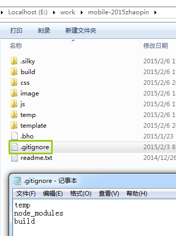

[菜鸟教程Git](https://www.runoob.com/git/git-tutorial.html)
[Reference](https://git-scm.com/docs)
##  Git 简明指南 
https://www.runoob.com/manual/git-guide/
创建新仓库
在文件夹目录下输入`git init`以创建新的 git 仓库。
或者`git init newrepo`指定目录为`newrepo`的文件夹

检出仓库
执行如下命令以创建一个本地仓库的克隆版本：
`git clone /path/to/repository`
如果是远端服务器上的仓库，你的命令会是这个样子：
`git clone username@host:/path/to/repository`

工作流
你的本地仓库由 git 维护的三棵“树”组成。第一个是你的 `工作目录`，它持有实际文件；第二个是 `暂存区（Index）`，它像个缓存区域，临时保存你的改动；最后是 `HEAD`，它指向你最后一次提交的结果。


添加和提交
你可以提出更改（把它们添加到暂存区），使用如下命令：
`git add <filename>`
`git add *`
这是 git 基本工作流程的第一步；使用如下命令以实际提交改动：
`git commit -m "代码提交信息"`
现在，你的改动已经提交到了 HEAD，但是还没到你的远端仓库。

推送改动
你的改动现在已经在本地仓库的 **HEAD** 中了。执行如下命令以将这些改动提交到远端仓库：
`git push origin master`
可以把 *master* 换成你想要推送的任何分支。

如果你还没有克隆现有仓库，并欲将你的仓库连接到某个远程服务器，你可以使用如下命令添加：
`git remote add origin <server>`
如此你就能够将你的改动推送到所添加的服务器上去了。

分支
分支是用来将特性开发绝缘开来的。在你创建仓库的时候，master 是“默认的”分支。在其他分支上进行开发，完成后再将它们合并到主分支上。

创建一个叫做“feature_x”的分支，并切换过去：
`git checkout -b feature_x`
切换回主分支：
`git checkout master`
再把新建的分支删掉：
`git branch -d feature_x`
除非你将分支推送到远端仓库，不然该分支就是 不为他人所见的：
`git push origin <branch>`

更新与合并
要更新你的本地仓库至最新改动，执行：
`git pull`
以在你的工作目录中 *获取（fetch）* 并 *合并（merge）* 远端的改动。
要合并其他分支到你的当前分支（例如 master），执行：
`git merge <branch>`
在这两种情况下，git 都会尝试去自动合并改动。遗憾的是，这可能并非每次都成功，并可能出现冲突（conflicts）。 这时候就需要你修改这些文件来手动合并这些冲突（conflicts）。改完之后，你需要执行如下命令以将它们标记为合并成功：
`git add <filename>`
在合并改动之前，你可以使用如下命令预览差异：
`git diff <source_branch> <target_branch>`

标签
为软件发布创建标签是推荐的。这个概念早已存在，在 SVN 中也有。你可以执行如下命令创建一个叫做 1.0.0 的标签：
`git tag 1.0.0 1b2e1d63ff`
1b2e1d63ff 是你想要标记的提交 ID 的前 10 位字符。可以使用下列命令获取提交 ID：
`git log`
你也可以使用少一点的提交 ID 前几位，只要它的指向具有唯一性。

替换本地改动
假如你操作失误（当然，这最好永远不要发生），你可以使用如下命令替换掉本地改动：
`git checkout -- <filename>`
此命令会使用 HEAD 中的最新内容替换掉你的工作目录中的文件。已添加到暂存区的改动以及新文件都不会受到影响。

假如你想丢弃你在本地的所有改动与提交，可以到服务器上获取最新的版本历史，并将你本地主分支指向它：
`git fetch origin`
`git reset --hard origin/master`

实用小贴士
内建的图形化 git：
`gitk`
彩色的 git 输出：
`git config color.ui true`
显示历史记录时，每个提交的信息只显示一行：
`git config format.pretty oneline`
交互式添加文件到暂存区：
`git add -i`


## 补充1
https://www.runoob.com/w3cnote/git-five-minutes-tutorial.html
### 提交版本
现在我们已经添加了这些文件，我们希望它们能够真正被保存在Git仓库。

为此，我们将它们提交到仓库。
```
git commit -m "Adding files"
```
如果您不使用-m，会出现编辑器来让你写自己的注释信息。

当我们修改了很多文件，而不想每一个都add，想commit自动来提交本地修改，我们可以使用-a标识。
```
git commit -a -m "Changed some files"
```
git commit 命令的-a选项可将所有被修改或者已删除的且已经被git管理的文档提交到仓库中。

千万注意，-a不会造成新文件被提交，只能修改。


### 取回更新
如果您已经按上面的进行push，下面命令表示，当前分支自动与唯一一个追踪分支进行合并。
```
git pull
```
从非默认位置更新到指定的url。
```
git pull http://git.example.com/project.git
```
### 删除
如何你想从资源库中删除文件，我们使用rm。
```
git rm file
```
### 分支与合并
分支在本地完成，速度快。要创建一个新的分支，我们使用branch命令。
```
git branch test
```
branch命令不会将我们带入分支，只是创建一个新分支。所以我们使用checkout命令来更改分支。
```
git checkout test
```
第一个分支，或主分支，被称为"master"。
```
git checkout master
```
对其他分支的更改不会反映在主分支上。如果想将更改提交到主分支，则需切换回master分支，然后使用合并。
```
git checkout master
git merge test
```
如果您想删除分支，我们使用-d标识。
```
git branch -d test
```
##  补充2
https://www.runoob.com/w3cnote/git-gui-window.html
### 忽略（.gitignore）

但实际上大部分我们的文件都是一起提交的，并不会逐一去甄选，又或者类似PSD这样的大源文件以及并不作为产品最终展示的过渡文件，我们可以统一放在临时文件夹中，并忽略此文件夹。

