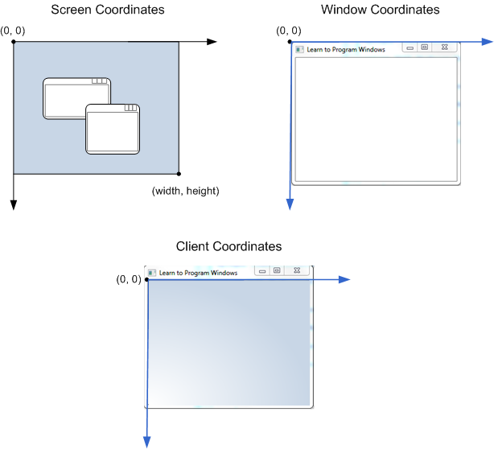
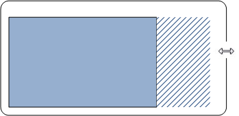

[Get Started with Win32 and C++](https://learn.microsoft.com/en-us/windows/win32/learnwin32/learn-to-program-for-windows)

## 前置知识

### windows编码约定

#### 类型

许多typedef都被定义在`WinDef.h`
Data type|	Size|	Signed?
------|---------|------------
BYTE|	8 bits|	Unsigned
DWORD|	32 bits|	Unsigned
INT32|	32 bits|	Signed
INT64|	64 bits|	Signed
LONG|	32 bits|	Signed
LONGLONG|	64 bits|	Signed
UINT32|	32 bits|	Unsigned
UINT64|	64 bits|	Unsigned
ULONG|	32 bits|	Unsigned
ULONGLONG|	64 bits|	Unsigned
WORD|	16 bits|	Unsigned

`DWORD`即`Double Word`，每个word为2个字节的长度，是指计算机中数值的位数(4字节，32位)

`BOOL`是`int`类型的别名
```c++
#define FALSE    0 
#define TRUE     1
```


大多数返回`BOOL`的函数能够返回非零值来表示布尔真值
正确方式即
```c++
if(func()){
    //...
}

//or

if(func() != FALSE){
    ///
}
```

不要写成`result == TRUE`

前缀`P-`和`LP-`表指针。`LP-`是为16为设计的，现在而这无区别，必须使用其一则用`P-


下面的类型大小总是指针大小，换言之，32位应用32bit，64位64bit
* DWORD_PTR
* INT_PTR
* LONG_PTR
* ULONG_PTR
* UINT_PTR`

这些类型在一个整型被转换为指针时使用，也用于定义指针运算的变量，遍历缓冲区所有字节的循环计数器，在64位windows中32位置扩展到64位

#### 匈牙利命名法

例如`cb`即count of bytes，`rw`和`col`意味着row和column数，dw即DWORD，w即WORD.

### 有关字符串

UTF-16编码，每个字符都被编码为一个或两个16bit值
ANSI编码，8bit值
为了区分，UTF-16使用了宽字符类型
```c++
typedef wchar_t WCHAR;
```
为了声明宽字符字面量，在字符串前面加'L'
```c++
wchar_t a = L'a';
wchar_t *str = L"hello";
```
一些字符串相关的typedef
Typedef	|Definition
-------|--------
CHAR	|char
PSTR or LPSTR	|char*
PCSTR or LPCSTR	|const char*
PWSTR or LPWSTR	|wchar_t*
PCWSTR or LPCWSTR	|const wchar_t*

#### Unicode和ANSI函数
* SetWindowTextA使用ANSI字符串
* SetWindowTextW使用Unicode字符串

在内部，ANSI的版本被转换成Unicode。windows也提供了一个宏，如果定义了`UNICODE`转换为unicode版本，否则ansi版本
```c++
#ifdef UNICODE
#define SetWindowText  SetWindowTextW
#else
#define SetWindowText  SetWindowTextA
#endif
```
该函数文档名为`SetWindowText`，尽管这是宏名字而非实际的函数名字

对于现在的应用都应该用unicode版，用ansi则无法本地化，并且因为要在运行时转换为unicode效率更低。取决于偏好可以使用`SetWindowTextW`或者宏

#### TCHARs
在某些情况下为unicode或ansi编译相同的代码很有用，windows sdk提供宏映射字符串到unicode或ansi，取决于平台

Macro|	Unicode|	ANSI
-----|---------|----
TCHAR|	wchar_t|	char
TEXT("x") or _T("x")|	L"x"|	"x"

当然现在TEXT和TCHAR都用得很少因为现在都用unicode

一些头文件使用预处理符`_UNICODE`和`UNICODE`。总是要定义这两，并且visual c++在创建新项目的时候总是默认定义他们两个

### 窗口


*application window* 或者*main window*，通常有一个带标题栏，最小化和最大化按钮以及其他UI元素的框架。因为操作系统管理窗口的框架的这一部分，框架被称为窗口的*non-client area*。里面的部分称为*client area*归应用程序管。


（窗口的其他类型）
UI控件，例如按钮和编辑栏全是窗口。UI控件和应用窗口的最大区别是UI空间因他自己存在，相反的位置相对于应用窗口。

#### 父窗口和所有窗口
对于UI控件的情况，控件窗口被称为应用窗口的子窗口，反过来应用窗口是控件窗口的父窗口。父窗口为子窗口的定位提供坐标系

应用程序窗口，所有窗口
对话窗口，被所有窗口

被所有窗口总是在所有窗口上面，并且随着所有窗口最小化和销毁。

#### 窗口句柄
项目通过使用句柄来应用窗口，数据类型即`HWND`。窗口句柄被`CreateWindow`和`CreateWindowEx`两个函数返回。为了对窗口进行操作，必须调用以句柄为参数的函数，例如`MoveWindow`
```c++
BOOL MoveWindow(HWND hWnd, int X, int Y, int nWidth, int nHeight, BOOL bRepaint);
```
`hwnd`是一个包含句柄的变量，不能解引用，否则会出错

#### 屏幕和窗口坐标
坐标以设备无关像素衡量。(0, 0) 总是左上角坐标


### WinMain应用入口点
每一个windows程序包含一个名为WinMain或者wWinMain的入口点
wWinMain的签名：
```c++
int WINAPI wWinMain(HINSTANCE hInstance, HINSTANCE hPrevInstance, PWSTR pCmdLine, int nCmdShow);
```
* *hInstance*是对一个模块或示例的句柄
* *hPrevInstance*被用在16bit windows，现在无意义，总为0
* *pCmdLine*包含以Unicode字符串的命令行参数
* *nCmdShow*是一个指示程序是否最小化，最大化或者正常显示的标志

操作系统不使用函数返回值，但是可以用返回值给另外一个程序传递状态代码

调用约定，例如`WINAPI`定义了一个函数如何从调用者那里获得参数，入栈顺序从右往左

WinMain和wWinMain差别是pCmdLine以ANSI字符串传递
[GetCommandLineA function (processenv.h)](https://learn.microsoft.com/en-us/windows/win32/api/processenv/nf-processenv-getcommandlinea)
[CommandLineToArgvW function (shellapi.h)](https://learn.microsoft.com/en-us/windows/win32/api/shellapi/nf-shellapi-commandlinetoargvw)

Microsoft C runtime library (CRT) 里面提供了main函数调用WinMain或wWinMain的实现

The CRT does some more work inside main. For example, it calls any static initializers before wWinMain. Although you can tell the linker to use a different entry-point function, you should use the default if you link to the CRT. Otherwise, the CRT initialization code is skipped, with unpredictable results such as global objects not being initialized correctly.

空wWinMain
```c++
int WINAPI WinMain(HINSTANCE hInstance, HINSTANCE hPrevInstance,
    PSTR lpCmdLine, int nCmdShow)
{
    return 0;
}
```

## 空白应用示例
[Walkthrough: Create a traditional Windows Desktop application (C++)](https://learn.microsoft.com/en-us/cpp/windows/walkthrough-creating-windows-desktop-applications-cpp?view=msvc-170)

```c++
#ifndef UNICODE
#define UNICODE
#endif 

#include <windows.h>

LRESULT CALLBACK WindowProc(HWND hwnd, UINT uMsg, WPARAM wParam, LPARAM lParam);

int WINAPI wWinMain(HINSTANCE hInstance, HINSTANCE hPrevInstance, PWSTR pCmdLine, int nCmdShow)
{
    // Register the window class.
    const wchar_t CLASS_NAME[]  = L"Sample Window Class";
    
    WNDCLASS wc = { };

    wc.lpfnWndProc   = WindowProc;
    wc.hInstance     = hInstance;
    wc.lpszClassName = CLASS_NAME;

    RegisterClass(&wc);

    // Create the window.

    HWND hwnd = CreateWindowEx(
        0,                              // Optional window styles.
        CLASS_NAME,                     // Window class
        L"Learn to Program Windows",    // Window text
        WS_OVERLAPPEDWINDOW,            // Window style

        // Size and position
        CW_USEDEFAULT, CW_USEDEFAULT, CW_USEDEFAULT, CW_USEDEFAULT,

        NULL,       // Parent window    
        NULL,       // Menu
        hInstance,  // Instance handle
        NULL        // Additional application data
        );

    if (hwnd == NULL)
    {
        return 0;
    }

    ShowWindow(hwnd, nCmdShow);

    // Run the message loop.

    MSG msg = { };
    while (GetMessage(&msg, NULL, 0, 0) > 0)
    {
        TranslateMessage(&msg);
        DispatchMessage(&msg);
    }

    return 0;
}

LRESULT CALLBACK WindowProc(HWND hwnd, UINT uMsg, WPARAM wParam, LPARAM lParam)
{
    switch (uMsg)
    {
    case WM_DESTROY:
        PostQuitMessage(0);
        return 0;

    case WM_PAINT:
        {
            PAINTSTRUCT ps;
            HDC hdc = BeginPaint(hwnd, &ps);

            // All painting occurs here, between BeginPaint and EndPaint.

            FillRect(hdc, &ps.rcPaint, (HBRUSH) (COLOR_WINDOW+1));

            EndPaint(hwnd, &ps);
        }
        return 0;

    }
    return DefWindowProc(hwnd, uMsg, wParam, lParam);
}
```
* wWinMain，入口点
* 填写WNDCLASS，填写窗口过程，句柄，类名
* RegisterClass注册类
* CreateWindowEx创建窗口
* ShowWindow显示窗口
* 消息循环，GetMessage，TranslateMessage，DispatchMessage

程序并未显式调用WindowProc。

每个窗口不同的数据称为实例数据（instance data）。每个窗口必须与一个窗口类（window class）相关联。

类名是当前进程的本地名称，因此名称只需在进程内唯一。不过，标准的 Windows 控件也有类。如果使用这些控件，则必须选择与控件类名不冲突的类名。例如，按钮控件的窗口类名为 Button。

[WNDCLASSA structure (winuser.h)](https://learn.microsoft.com/en-us/windows/win32/api/winuser/ns-winuser-wndclassa)
[RegisterClassA function (winuser.h)](https://learn.microsoft.com/en-us/windows/win32/api/winuser/nf-winuser-registerclassa)
[CreateWindowExA function (winuser.h)](https://learn.microsoft.com/en-us/windows/win32/api/winuser/nf-winuser-createwindowexa)
[Window Styles](https://learn.microsoft.com/en-us/windows/win32/winmsg/window-styles)


### 窗口消息
一个应用可以有几个窗口，每个窗口都有自己的窗口过程。

操作系统会为每个创建窗口的线程创建一个窗口消息队列。该队列为该线程创建的所有窗口保存消息。队列本身对程序是隐藏的。你无法直接操作队列。不过，您可以通过调用 [GetMessage](https://learn.microsoft.com/en-us/windows/desktop/api/winuser/nf-winuser-getmessage) 函数从队列中提取消息。
```c++
MSG msg;
GetMessage(&msg, NULL, 0, 0);
```
该函数从队列头部删除第一条消息。如果队列为空，该函数将阻塞，直到有其他消息进入队列。无消息时程序实际上是无事可做，如果要进行后台处理可以创建额外进程让GetMessage等待消息时继续运行。

GetMessage的其他三个参数用于过滤从队列中获取的信息。几乎在所有情况下，都会将这些参数设置为零。

TranslateMessage 函数与键盘输入有关。它将按键（下键、上键）转换为字符。不必了解该函数的工作原理，只需记住在调用 DispatchMessage 之前调用该函数即可。

DispatchMessage 函数告诉操作系统调用消息目标窗口的窗口过程。换句话说，操作系统会在窗口表中查找窗口句柄，找到与窗口相关的函数指针，并调用该函数。

窗口过程返回时，会返回 DispatchMessage。这将返回消息循环以获取下一条消息。只要程序还在运行，消息就会不断到达队列，因此必须有循环

通常，GetMessage 返回一个非零值，要退出应用程序并脱离消息循环，则调用 PostQuitMessage 函数

```c++
PostQuitMessage(0);
```

PostQuitMessage 函数会在消息队列中加入一条 WM_QUIT 消息。

WM_QUIT 特殊，会导致 GetMessage 返回零

有趣的是，窗口过程永远不会收到 WM_QUIT 消息，故不必在窗口过程中为该消息设置 case 语句

有时，操作系统会绕过队列直接调用窗口过程
post消息即表示消息进入消息队列，并通过消息循环
send消息即表示跳过队列直接由操作系统调用窗口过程

应用程序在窗口之间传播消息时这点就会有所区别

### 窗口过程
窗口过程签名
```c++
LRESULT CALLBACK WindowProc(HWND hwnd, UINT uMsg, WPARAM wParam, LPARAM lParam);
```
CALLBACK即函数的调用约定

lParam和wParam都是一个指针的大小，具体含义取决于消息代码。对每种消息，都需要查阅消息代码然后把参数转换为正确的数据类型。

在窗口过程执行期间，它会阻止在同一线程上创建的窗口的任何其他消息，因此避免在窗口过程中过长的处理

例如，程序打开了一个 TCP 连接，并无限期地等待服务器响应。如果在窗口过程中这样做，用户界面将不会响应，直到请求完成。在此期间，窗口无法处理鼠标或键盘输入、重新绘制甚至关闭。

相反，应该使用 Windows 内置的多任务处理工具，将工作转移到另一个线程中：
* 创建新线程。
* 使用线程池。
* 使用异步 I/O 调用。
* 使用异步过程调用。

### 绘制窗口
有时，程序会启动绘制来更新窗口的外观。有时，操作系统会通知您必须重新绘制窗口的一部分。此时，操作系统会向窗口发送一条 WM_PAINT 消息。必须绘制的窗口部分称为更新区域。

窗口首次显示时，必须绘制窗口的整个客户端区域。因此，在显示窗口时，总是会收到至少一条 WM_PAINT 消息。


周围的框架（标题栏，最大化）是由操作系统绘制。完成客户端区域的绘制后将清除更新区域，将告诉操作系统，在发生变化之前，它不需要发送另一条 WM_PAINT 消息。窗口被遮住的部分再次可见时，这部分区域会被添加为更新区域，窗口会收到另外一条WM_PAINT消息

拉伸窗口也会导致更新

```c++
switch (uMsg)
{
    case WM_PAINT:
    {
        PAINTSTRUCT ps;
        HDC hdc = BeginPaint(hwnd, &ps);

        // All painting occurs here, between BeginPaint and EndPaint.

        FillRect(hdc, &ps.rcPaint, (HBRUSH) (COLOR_WINDOW+1));

        EndPaint(hwnd, &ps);
    }
    return 0;
}
```
通过调用 [BeginPaint](https://learn.microsoft.com/en-us/windows/win32/api/winuser/nf-winuser-beginpaint) 函数开始绘制操作。该函数将重绘请求的信息填入 PAINTSTRUCT 结构。PAINTSTRUCT 的 rcPaint 成员给出了当前的更新区域。该更新区域是相对于客户端区域定义的。hdc即handle to a display device


[FillRect](https://learn.microsoft.com/en-us/windows/desktop/api/winuser/nf-winuser-fillrect)是 Graphics Device Interface (GDI)的一部分。在 Windows 7 中，微软引入了一个名为 Direct2D 的新图形引擎，它支持高性能图形操作，例如硬件加速。

完成绘制后，调用 EndPaint 函数。该函数将清除更新区域，向 Windows 发出窗口已完成绘制的信号。

### 关闭窗口
当按关闭按钮时，或ALT+F4时，队列有WM_CLOSE消息，默认处理是DestroyWindow
[DestroyWindow function (winuser.h)](https://learn.microsoft.com/en-us/windows/win32/api/winuser/nf-winuser-destroywindow)
DestroyWindow函数发送 WM_DESTROY和WM_NCDESTROY消息
通常对WM_DESTROY的响应是调用PostQuitMessage


### 管理应用状态
CreateWindowEx 函数提供了一种向窗口传递任何数据结构的方法，调用此函数会向消息队列发送WM_NCCREATE和WM_CREATE消息。

CreateWindowEx 的最后一个参数是一个 void* 类型的指针，窗口过程在处理 WM_NCCREATE 或 WM_CREATE 消息时，可以从消息数据中提取该值。

首先定义一个类
```c++
// Define a structure to hold some state information.

struct StateInfo {
    // ... (struct members not shown)
};
```
当调用 CreateWindowEx，传递该结构的指针给该函数的最后一个void*参数
```c++
StateInfo *pState = new (std::nothrow) StateInfo;

if (pState == NULL)
{
    return 0;
}

// Initialize the structure members (not shown).

HWND hwnd = CreateWindowEx(
    0,                              // Optional window styles.
    CLASS_NAME,                     // Window class
    L"Learn to Program Windows",    // Window text
    WS_OVERLAPPEDWINDOW,            // Window style

    // Size and position
    CW_USEDEFAULT, CW_USEDEFAULT, CW_USEDEFAULT, CW_USEDEFAULT,

    NULL,       // Parent window    
    NULL,       // Menu
    hInstance,  // Instance handle
    pState      // Additional application data
    );
```

收到 WM_NCCREATE 和 WM_CREATE 消息时，每条消息的 lParam 参数都是指向 CREATESTRUCT 结构的指针。而 CREATESTRUCT 结构则包含向 CreateWindowEx 传递的指针。


提取改数据结构指针的方法：
首先，通过转换 lParam 参数获取 CREATESTRUCT 结构
```c++
CREATESTRUCT *pCreate = reinterpret_cast<CREATESTRUCT*>(lParam);
```
CREATESTRUCT 结构的 lpCreateParams 成员是在 CreateWindowEx 中指定的原始 void 指针。
```c++
pState = reinterpret_cast<StateInfo*>(pCreate->lpCreateParams);
```
接下来，调用 [SetWindowLongPtr](https://learn.microsoft.com/en-us/windows/desktop/api/winuser/nf-winuser-setwindowlongptra) 函数，并传入数据结构的指针。
```
SetWindowLongPtr(hwnd, GWLP_USERDATA, (LONG_PTR)pState);
```
（[GWLP_USERDATA](https://learn.microsoft.com/en-us/windows/win32/api/winuser/nf-winuser-setwindowlongptra)是给创建窗口的应用使用，LONG_PTR强制类型转换）
调用最后一个函数的目的是将 StateInfo 指针存储到窗口的实例数据中。这样做之后，就可以通过调用 [GetWindowLongPtr](https://learn.microsoft.com/en-us/windows/desktop/api/winuser/nf-winuser-getwindowlongptra) 从窗口中取回指针：
```c++
LONG_PTR ptr = GetWindowLongPtr(hwnd, GWLP_USERDATA);
StateInfo *pState = reinterpret_cast<StateInfo*>(ptr);
```
可以创建多个窗口，每个窗口都有自己实例数据。把GetWindowLongPtr封装起来十分方便：
```c++
inline StateInfo* GetAppState(HWND hwnd)
{
    LONG_PTR ptr = GetWindowLongPtr(hwnd, GWLP_USERDATA);
    StateInfo *pState = reinterpret_cast<StateInfo*>(ptr);
    return pState;
}
```
窗口过程就可以这么写：
```c++
LRESULT CALLBACK WindowProc(HWND hwnd, UINT uMsg, WPARAM wParam, LPARAM lParam)
{
    StateInfo *pState;
    if (uMsg == WM_CREATE)
    {
        CREATESTRUCT *pCreate = reinterpret_cast<CREATESTRUCT*>(lParam);
        pState = reinterpret_cast<StateInfo*>(pCreate->lpCreateParams);
        SetWindowLongPtr(hwnd, GWLP_USERDATA, (LONG_PTR)pState);
    }
    else
    {
        pState = GetAppState(hwnd);
    }

    switch (uMsg)
    {


    // Remainder of the window procedure not shown ...

    }
    return TRUE;
}
```

#### 对象导向的方法
我们已经定义了一个数据结构来保存窗口的状态信息。为这个数据结构提供对数据进行操作的成员函数（方法）是很有意义的。
从这：
```c++
// pseudocode

LRESULT CALLBACK WindowProc(HWND hwnd, UINT uMsg, WPARAM wParam, LPARAM lParam)
{
    StateInfo *pState;

    /* Get pState from the HWND. */

    switch (uMsg)
    {
        case WM_SIZE:
            HandleResize(pState, ...);
            break;

        case WM_PAINT:
            HandlePaint(pState, ...);
            break;

       // And so forth.
    }
}
```
到
```c++
// pseudocode

LRESULT MyWindow::WindowProc(UINT uMsg, WPARAM wParam, LPARAM lParam)
{
    switch (uMsg)
    {
        case WM_SIZE:
            this->HandleResize(...);
            break;

        case WM_PAINT:
            this->HandlePaint(...);
            break;
    }
}
```
对于`MyWindow::WindowProc` 方法，因为是类，默认是有this指针的，因此要是静态函数
```c++
template <class DERIVED_TYPE> 
class BaseWindow
{
public:
    static LRESULT CALLBACK WindowProc(HWND hwnd, UINT uMsg, WPARAM wParam, LPARAM lParam)
    {
        DERIVED_TYPE *pThis = NULL;

        if (uMsg == WM_NCCREATE)
        {
            CREATESTRUCT* pCreate = (CREATESTRUCT*)lParam;
            pThis = (DERIVED_TYPE*)pCreate->lpCreateParams;
            SetWindowLongPtr(hwnd, GWLP_USERDATA, (LONG_PTR)pThis);

            pThis->m_hwnd = hwnd;
        }
        else
        {
            pThis = (DERIVED_TYPE*)GetWindowLongPtr(hwnd, GWLP_USERDATA);
        }
        if (pThis)
        {
            return pThis->HandleMessage(uMsg, wParam, lParam);
        }
        else
        {
            return DefWindowProc(hwnd, uMsg, wParam, lParam);
        }
    }

    BaseWindow() : m_hwnd(NULL) { }

    BOOL Create(
        PCWSTR lpWindowName,
        DWORD dwStyle,
        DWORD dwExStyle = 0,
        int x = CW_USEDEFAULT,
        int y = CW_USEDEFAULT,
        int nWidth = CW_USEDEFAULT,
        int nHeight = CW_USEDEFAULT,
        HWND hWndParent = 0,
        HMENU hMenu = 0
        )
    {
        WNDCLASS wc = {0};

        wc.lpfnWndProc   = DERIVED_TYPE::WindowProc;
        wc.hInstance     = GetModuleHandle(NULL);
        wc.lpszClassName = ClassName();

        RegisterClass(&wc);

        m_hwnd = CreateWindowEx(
            dwExStyle, ClassName(), lpWindowName, dwStyle, x, y,
            nWidth, nHeight, hWndParent, hMenu, GetModuleHandle(NULL), this
            );

        return (m_hwnd ? TRUE : FALSE);
    }

    HWND Window() const { return m_hwnd; }

protected:

    virtual PCWSTR  ClassName() const = 0;
    virtual LRESULT HandleMessage(UINT uMsg, WPARAM wParam, LPARAM lParam) = 0;

    HWND m_hwnd;
};
```
`BaseWindow` 类是一个抽象基类，具体的窗口类都是从它派生出来的。例如，下面是一个从 `BaseWindow` 派生的简单类的声明：
```c++
class MainWindow : public BaseWindow<MainWindow>
{
public:
    PCWSTR  ClassName() const { return L"Sample Window Class"; }
    LRESULT HandleMessage(UINT uMsg, WPARAM wParam, LPARAM lParam);
};
```
要创建窗口，请调用`BaseWindow::Create`
```c++
int WINAPI wWinMain(HINSTANCE hInstance, HINSTANCE, PWSTR pCmdLine, int nCmdShow)
{
    MainWindow win;

    if (!win.Create(L"Learn to Program Windows", WS_OVERLAPPEDWINDOW))
    {
        return 0;
    }

    ShowWindow(win.Window(), nCmdShow);

    // Run the message loop.

    MSG msg = { };
    while (GetMessage(&msg, NULL, 0, 0))
    {
        TranslateMessage(&msg);
        DispatchMessage(&msg);
    }

    return 0;
}
```
纯虚方法`BaseWindow::HandleMessage`被用于实现窗口过程
```c++
LRESULT MainWindow::HandleMessage(UINT uMsg, WPARAM wParam, LPARAM lParam)
{
    switch (uMsg)
    {
    case WM_DESTROY:
        PostQuitMessage(0);
        return 0;

    case WM_PAINT:
        {
            PAINTSTRUCT ps;
            HDC hdc = BeginPaint(m_hwnd, &ps);
            FillRect(hdc, &ps.rcPaint, (HBRUSH) (COLOR_WINDOW+1));
            EndPaint(m_hwnd, &ps);
        }
        return 0;

    default:
        return DefWindowProc(m_hwnd, uMsg, wParam, lParam);
    }
    return TRUE;
}
```
（请注意，窗口句柄存储在一个成员变量 (m_hwnd) 中，因此我们无需将其作为参数传递给 HandleMessage。）

## 在基于windows的程序使用COM
Component Object Model (COM)

### COM接口是什么

```c++
// The following is not actual COM.

// Pseudo-C++:

interface IDrawable
{
    void Draw();
};
```
IDrawable接口定义了任何继承此类的类都必须实现

所有接口都是抽象的，因此程序无法创建 IDrawable 对象的实例。例如，以下代码将无法编译。
```c++
IDrawable draw;
draw.Draw();
```
相反，图形库提供了实现 IDrawable 接口的对象。例如，图形库可能会提供用于绘制形状的形状对象和用于绘制图像的位图对象。在 C++ 中，这是通过继承一个普通的抽象基类来实现的：
```c++
class Shape : public IDrawable
{
public:
    virtual void Draw();    // Override Draw and provide implementation.
};

class Bitmap : public IDrawable
{
public:
    virtual void Draw();    // Override Draw and provide implementation.
};
```
Shape 和Bitmap 类都继承自 IDrawable，并提供自己的 Draw 方法实现，而实现可能会有很大不同。

通过 IDrawable 指针来操作 Shape 和 Bitmap 对象，而不是直接使用 Shape 或 Bitmap 指针。
```c++
IDrawable *pDrawable = CreateTriangleShape();

if (pDrawable)
{
    pDrawable->Draw();
}
```
多态例子
```c++
void DrawSomeShapes(IDrawable **drawableArray, size_t count)
{
    for (size_t i = 0; i < count; i++)
    {
        drawableArray[i]->Draw();
    }
}
```
COM 的一个关键点是，调用代码永远不会看到派生类的类型。换句话说，你永远不会在代码中声明 Shape 或 Bitmap 类型的变量。对形状和位图的所有操作都是使用 IDrawable 指针执行的。通过这种方式，COM 保持了接口和实现之间的严格分离。Shape 和 Bitmap 类的实现细节可以更改--例如，为了修复错误或添加新功能--而不需要更改调用代码。

在 C++ 实现中，接口是使用类或结构来声明的。
```c++
class IDrawable
{
public:
    virtual void Draw() = 0;
};
```
COM是接口并不是对象，只是一群对象必须实现的方法的集合

考虑下面的类声明：
```c++
// An interface for serialization.
class ISerializable
{
public:
    virtual void Load(PCWSTR filename) = 0;    // Load from file.
    virtual void Save(PCWSTR filename) = 0;    // Save to file.
};

// Declarations of drawable object types.

class Shape : public IDrawable
{
    ...
};

class Bitmap : public IDrawable, public ISerializable
{
    ...
};
```


（上面的都是演示的代码，并非实际）