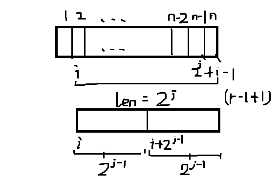

参考oiwiki上的[ST 表](https://oi-wiki.org/ds/sparse-table/)
ST 表（Sparse Table，稀疏表）是用于解决 **可重复贡献问题** 的数据结构。

>ST 表模板题
>
>题目大意：给定 n 个数，有 m 个询问，对于每个询问，你需要回答区间 [l,r] 中的最大值。
>
>考虑暴力做法。每次都对区间 [l,r] 扫描一遍，求出最大值。
>
>显然，这个算法会超时。


考虑这样的问题，是否存在这样一种数据结构
对st[0][i]的例子，表示的是区间长度$2^i$，从$a_0$到$a_{0+2^i}$范围内的最大值，这样可以做到一次查询求此区间的最大值

对于区间长度非$2^n$的，可以用两个这样的来表示。
对于$[l,r]$，分成两部分$[l,l+2^s-1]$ ， $[r-2^s+1,r]$，其中 $s=\left\lfloor\log_2(r-l+1)\right\rfloor$

对于查询$[l,r]$，查询后返回两部分的最大值即可

初始化的$f(i,j)=\max(f(i,j-1),f(i+2^{j-1},j-1))$
区间长度都是$2^{j-1}$
并且每次用[std::log](https://en.cppreference.com/w/cpp/numeric/math/log)并不划算，改成了
$\begin{cases}
\texttt{Logn}[1] \gets 0, \\
\texttt{Logn}\left[i\right] \gets \texttt{Logn}\left[\frac{i}{2}\right] + 1.
\end{cases}$
的处理

$\lfloor\log_2 n\rfloor=\lfloor\log_2 (\frac n 2)\rfloor+1$

c风格模板
```c++
#include <algorithm>
#include <iostream>
using namespace std;
constexpr int MAXN = 2000001;
constexpr int logN = 21;
int f[MAXN][logN + 1], Logn[MAXN + 1];

void pre() {  // 准备工作，初始化
  Logn[1] = 0;
  Logn[2] = 1;
  for (int i = 3; i < MAXN; i++) {
    Logn[i] = Logn[i / 2] + 1;
  }
}

int main() {
  cin.tie(nullptr)->sync_with_stdio(false);
  int n, m;
  cin >> n >> m;
  for (int i = 1; i <= n; i++) cin >> f[i][0];
  pre();
  for (int j = 1; j <= logN; j++)
    for (int i = 1; i + (1 << j) - 1 <= n; i++)
      f[i][j] = max(f[i][j - 1], f[i + (1 << (j - 1))][j - 1]);  // ST表具体实现
  for (int i = 1; i <= m; i++) {
    int x, y;
    cin >> x >> y;
    int s = Logn[y - x + 1];
    cout << max(f[x][s], f[y - (1 << s) + 1][s]) << '\n';
  }
  return 0;
}
```

st的`MAXLOGN + 1`加1是因为从零索引，而`j <= logN`
解释一下st的初始化为什么是这样：
```c++
for (int j = 1; j <= logN; j++)
    for (int i = 1; i + (1 << j) - 1 <= n; i++)
      f[i][j] = max(f[i][j - 1], f[i + (1 << (j - 1))][j - 1]);
```
* 因为是用到了**倍增**，所以这个是一层一层赋值的，所以最外面一层是`j`，并且注意`j`不要越界即可
* 第二层for是i，i的限制条件是`i + (1 << j) - 1 <= n`，即${i+2^j-1}$，是因为对于下面的`f[i][j]`来说，表示的是从`f[i][0]`到`f[i + (1 << j) - 1][0]`，对于后面的不能越界，所以是`i + (1 << j) - 1 <=n`（数组从1开始索引）

* 然后就是这个递推结构了
$f(i,j)=\max(f(i,j-1),f(i+2^{j-1},j-1))$
看图就很容易理解好吧，递推的前`f[i][j - 1]`,`f[i + (1 << (j - 1))][j - 1]`，最后再去他们两的最大值即可
* 对于查询，取`int s = Logn[y - x + 1];`，即$s=\left\lfloor\log_2(r-l+1)\right\rfloor$，可以将其划分为两个区间，取$[l,l+2^s-1]$ ， $[r-2^s+1,r]$的最大值即可（因为s算的是整长度，即长度是$2^s$，所以第二个索引就是$s$）

c++风格模板
```c++
#include <bits/stdc++.h>
using namespace std;

template <typename T>
class SparseTable {
  using VT = vector<T>;
  using VVT = vector<VT>;
  using func_type = function<T(const T &, const T &)>;

  VVT ST;

  static T default_func(const T &t1, const T &t2) { return max(t1, t2); }

  func_type op;

 public:
  SparseTable(const vector<T> &v, func_type _func = default_func) {
    op = _func;
    int len = v.size(), l1 = ceil(log2(len)) + 1;
    ST.assign(len, VT(l1, 0));
    for (int i = 0; i < len; ++i) {
      ST[i][0] = v[i];
    }
    for (int j = 1; j < l1; ++j) {
      int pj = (1 << (j - 1));
      for (int i = 0; i + pj < len; ++i) {
        ST[i][j] = op(ST[i][j - 1], ST[i + (1 << (j - 1))][j - 1]);
      }
    }
  }

  T query(int l, int r) {
    int lt = r - l + 1;
    int q = floor(log2(lt));
    return op(ST[l][q], ST[r - (1 << q) + 1][q]);
  }
};
```
