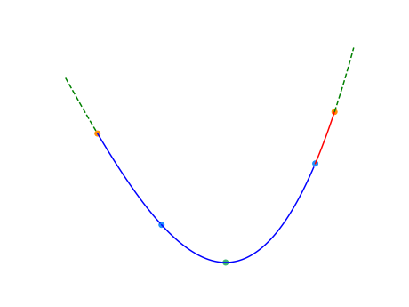

[二分](https://oi-wiki.org/basic/binary/)

## 二分法

必须单调
>### 过程
>以在一个升序数组中查找一个数为例。
>
>它每次考察数组当前部分的中间元素，如果中间元素刚好是要找的，就结束搜索过程；如果中间元素小于所查找的值，那么左侧的只会更小，不会有所查找的元素，只需到右侧查找；如果中间元素大于所查找的值同理，只需到左侧查找。

实现
```c++
int binary_search(int start, int end, int key) {
  int ret = -1;  // 未搜索到数据返回-1下标
  int mid;
  while (start <= end) {
    mid = start + ((end - start) >> 1);  // 直接平均可能会溢出，所以用这个算法
    if (arr[mid] < key)
      start = mid + 1;
    else if (arr[mid] > key)
      end = mid - 1;
    else {  // 最后检测相等是因为多数搜索情况不是大于就是小于
      ret = mid;
      break;
    }
  }
  return ret;  // 单一出口
}
```
这个是闭区间上的二分，在某些情况下，考虑特定边界条件，当$mid$不符合条件时候，$end=mid -1$，而当符合条件时候，$start = mid$
[P8647 [蓝桥杯 2017 省 AB] 分巧克力](https://www.luogu.com.cn/problem/P8647)

取决于边界条件（左右边界的更新）和搜索策略，再来确定mid向左边还是右边取（向上还是向下取整），因此边界条件的确定是难点

一般是闭区间二分，所以经常会出现`start = mid + 1;`和`end = mid - 1;`这种写法，这种边界条件的写法也是很重要的（不小心写错/不准确可能就会死循环）

单调递减区间，条件是`l < r`，当`l == r`时候跳出循环，无所谓向下还是向上取整了？

## 三分法
求单峰函数的极值点->三分法

> 三分法与二分法的基本思想类似，但每次操作需在当前区间 $[l,r]$（下图中除去虚线范围内的部分）内任取两点 $lmid,rmid(lmid < rmid)$（下图中的两蓝点）。如下图，如果 $f(lmid)<f(rmid)$，则在 $[rmid,r]$（下图中的红色部分）中函数必然单调递增，最小值所在点（下图中的绿点）必然不在这一区间内，可舍去这一区间。反之亦然。
>
>
>在计算 $lmid$ 和 $rmid$ 时，需要防止数据溢出的现象出现。
>三分法每次操作会舍去两侧区间中的其中一个。为减少三分法的操作次数，应使两侧区间尽可能大。因此，每一次操作时的 $lmid$ 和 $rmid$ 分别取 $mid-\varepsilon$ 和 $mid+\varepsilon$ 是一个不错的选择。
>实现
>```c++
>while (r - l > eps) {
>  mid = (l + r) / 2;
>  lmid = mid - eps;
>  rmid = mid + eps;
>  if (f(lmid) < f(rmid))
>    r = mid;
>  else
>    l = mid;
>}
>```
>

对于整数三分也可以用闭区间三分，$[l,r]$之间可能取最小值时
（找最小值为例子）
```c++
  int min = INT_MAX;
	while (right - left >= 2) {
		int lmid = left + (right - left) / 3;
		int rmid = right - (right - left) / 3;
    
    int lmv = f(lmid);
    int rmv = f(rmid);
    int min_v = min({min_v,lmv,rmv});

    if (lmv < rmv) {
			right = rmid - 1;//右边边界向左
		}
		else {
			left = lmid + 1;//左边边界向右
		}
  }
  min = min({min_v,f(left),f(right)})
```
当$l$和$r$差1的时候结束循环。因为是闭区间三分，已有的$l$或者$r$也可能是$x_{min}$，同时，介于$l$和$r$的$\frac{a+b}{2}$的函数值也可能取最小值（即min_v），所以最后运算$min\{min\_v,f(left),f(right)\}$