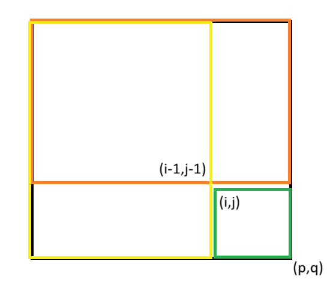

## 前缀和与差分
前缀和 与 差分是一对互逆过程
比如你有这么一段数：
1 3 5 4 6 8 9
差分化：计算出前一项与本项的差 b[1] = a[1] ,b[n] = a[n] - a[n - 1]
1 2 2 -1 2 2 1
前缀和：将前面的全加起来
1 3 5 4 6 8 9

区间值求和：前缀和
区间值修改：差分

### 一维前缀和与差分

前缀和
$b_1=a_1,b_n=a_n+a_{n-1}$
$[l,r]$求和则$b_r-b_{l-1}$
(可以认为$a_0=0$直接$b_n=a_n+a_{n-1}$，差分同理)
注意是`sum[i] = pre[i] + sum[i - 1];`
不是`sum[i] = pre[i] + pre[i - 1];`

差分
$b_1=a_1,b_n=a_n+a_{n-1}$
区间操作
将原数组进行区间的运算，相当于对差分数组的开始位置做同样的操作，而对其结束位置的后一位进行相反操作。

举例：

将数组区间 $[l,r]$加上$x$:
```c++
cin >> l >> r >> x;
s[l] += x,s[r + 1] -= x;
```


### 二维前缀和与差分
前缀和：
$S_{i,j}=\displaystyle \sum_{i'\leq i} \sum_{j'\leq j}A_{i',j'}$
容斥原理可得递推关系：
$S_{i,j}=A_{i,j}+S_{i-1,j}+S_{i,j-1}-S_{i-1,j-1}$

实现时直接遍历$(i,j)$求和即可
要查询左上角$(i_1,j_1)$右下角$(i_2,j_2)$的子矩阵和，可以计算
$S_{i_2,j_2}-S_{i_1,j_2}-S_{i_2,j_1}+S_{i_1,j_1}$


* 求绿色部分$A_{i,j}$到$A_{p,q}$
用$S_{p,q}-S_{i-1,q}-S_{p,j-1}+S_{i-1,j-1}$

 
差分：

性质
* $a_i$的值是 $b_i$的前缀和，即 
* $a_n=\sum\limits_{i=1}^nb_i$
计算 a_i 的前缀和 
$sum=\sum\limits_{i=1}^na_i=\sum\limits_{i=1}^n\sum\limits_{j=1}^{i}b_j=\sum\limits_{i=1}^n(n-i+1)b_i$


```
0 0 0 0 0
0 1 1 1 0
0 1 1 1 0
0 1 1 1 0
0 0 0 0 0
```
求差分后
```
0 0 0 0 0
0 1 0 0 -1
0 0 0 0 0
0 0 0 0 0
0 -1 0 0 1
```


参见[前缀和 & 差分(OI wiki)](https://oi-wiki.org/basic/prefix-sum/)

