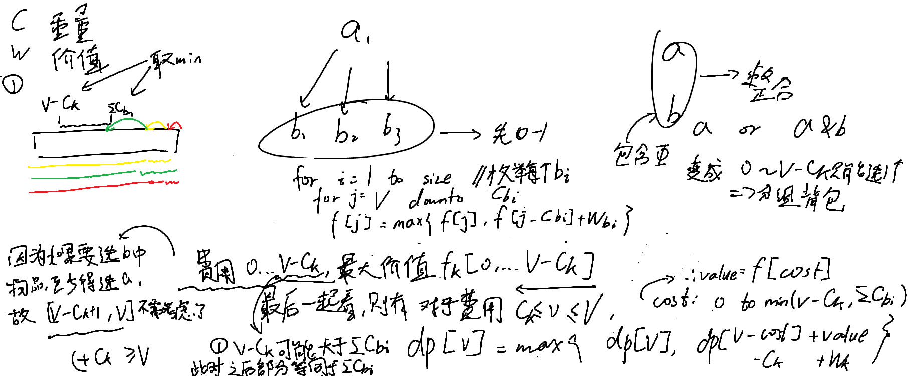

参考[oiwiki上的背包 DP](https://oi-wiki.org/dp/knapsack/)
### 0-1 背包
一个物品只能选一次，要么选或者不选，即0，1
第 $i$ 个物品的重量 $w_{i}$，价值 $v_{i}$，以及背包的总容量 $W$

对于每个$i$，当前重量对应价值$f_j$的更新依赖于上一次的重量对应价值$f_j$和**上一次**的重量对应价值减去重量加上价值$f_{j-w_i}+v_i$，取二者的最大值（为了保证是上一次，迭代的时候是自$W$至$w_i$）

转移方程$$ f_j=\max \left(f_j,f_{j-w_i}+v_i\right)$$

示例代码
```c++
for (int i = 1; i <= n; i++)
  for (int l = W; l >= w[i]; l--) f[l] = max(f[l], f[l - w[i]] + v[i]);
```

### 完全背包
一个物品可以选无穷次
状态转移方程：
$$f_{i,j}=\max_{k=0}^{+\infty}(f_{i-1,j-k\times w_i}+v_i\times k)$$
让$f_{i,j-w_i}$ 的更新依赖于$ f_{i,j-2\times w_i} $，进行优化后：
$f_{i,j}=\max(f_{i-1,j},f_{i,j-w_i}+v_i)$
```c++
#include <iostream>
using namespace std;
constexpr int MAXN = 1e4 + 5;
constexpr int MAXW = 1e7 + 5;
int n, W, w[MAXN], v[MAXN];
long long f[MAXW];

int main() {
  cin >> W >> n;
  for (int i = 1; i <= n; i++) cin >> w[i] >> v[i];
  for (int i = 1; i <= n; i++)
    for (int l = w[i]; l <= W; l++)
      if (f[l - w[i]] + v[i] > f[l]) f[l] = f[l - w[i]] + v[i];  // 核心状态方程
  cout << f[W];
  return 0;
}
```

### 多重背包
每种物品有 $k_i$ 个，而非一个
#### 朴素做法
k个物品给放出来，或者说对于k个物品中的任意一个，只能选一次
状态转移方程
$$f_{i,j}=\max_{k=0}^{k_i}(f_{i-1,j-k\times w_i}+v_i\times k)$$
这样做与0-1背包解决方法相同
代码
```c++
for (int i = 1; i <= n; i++) {
  for (int weight = W; weight >= w[i]; weight--) {
    // 多遍历一层物品数量
    for (int k = 1; k * w[i] <= weight && k <= cnt[i]; k++) {
      dp[weight] = max(dp[weight], dp[weight - k * w[i]] + k * v[i]);
    }
  }
}
```
#### 二进制分组优化
$A_{i,j}$ 代表第 $i$ 种物品拆分出的第 $j$ 个物品。
「同时选 $A_{i,1},A_{i,2}$」与「同时选 $A_{i,2},A_{i,3}$」完全等效，需化简拆分方式
##### 过程
「二进制分组」
令 $A_{i,j}\left(j\in\left[0,\lfloor \log_2(k_i+1)\rfloor-1\right]\right)$ 分别表示由 $2^{j}$ 个单个物品「捆绑」而成的大物品。特殊地，若 $k_i+1$ 不是 $2$ 的整数次幂，则需要在最后添加一个由 $k_i-2^{\lfloor \log_2(k_i+1)\rfloor-1}$ 个单个物品「捆绑」而成的大物品用于补足。

例子：

-   $6=1+2+3$
-   $8=1+2+4+1$
-   $18=1+2+4+8+3$
-   $31=1+2+4+8+16$

复杂度 
$O(W\sum_{i=1}^n\log_2k_i)$

代码：
p单件物品重量，h单件物品价值，k表示物品数
作用是成功**把组给划分**了出来放到list数组里面，最后再利用0-1背包的代码即可解决
```c++
index = 0;
for (int i = 1; i <= m; i++) {
  int c = 1, p, h, k;
  cin >> p >> h >> k;
  while (k > c) {
    k -= c;
    list[++index].w = c * p;
    list[index].v = c * h;
    c *= 2;
  }
  list[++index].w = p * k;
  list[index].v = h * k;
}
```
### 混合背包
有的只能取一次，有的能取无限次，有的只能取 $k$ 次。
伪代码：
```c++
for (循环物品种类) {
  if (是 0 - 1 背包)
    套用 0 - 1 背包代码;
  else if (是完全背包)
    套用完全背包代码;
  else if (是多重背包)
    套用多重背包代码;
}
```
### 二维费用背包
只需在状态中增加一维存放第二种价值即可
代码
```c++
for (int k = 1; k <= n; k++)
  for (int i = m; i >= mi; i--)    // 对经费进行一层枚举
    for (int j = t; j >= ti; j--)  // 对时间进行一层枚举
      dp[i][j] = max(dp[i][j], dp[i - mi][j - ti] + 1);
```
### 分组背包
从0-1背包的“每个物品选或不选”变成了“每组物品选一个，或者不选”
可以将 $t_{k,i}$ 表示第 $k$ 组的第 $i$ 件物品的编号是多少，再用 $\mathit{cnt}_k$ 表示第 $k$ 组物品有多少个
通过先循环背包容量，再循环物品，使得每个dp在每一轮循环中只选择每组物品的一个

第一行的循环把0-1背包的“每个物品”→“循环每个组”，使得每个组只选择一个物品或者不选
第二行按照重量递减，依次更新
第三行枚举这个组的所有物品
代码：
```c++
for (int k = 1; k <= ts; k++)          // 循环每一组
  for (int i = m; i >= 0; i--)         // 循环背包容量
    for (int j = 1; j <= cnt[k]; j++)  // 循环该组的每一个物品
      if (i >= w[t[k][j]])             // 背包容量充足
        dp[i] = max(dp[i],
                    dp[i - w[t[k][j]]] + c[t[k][j]]);  // 像0-1背包一样状态转移
```
### 有依赖的背包

把每个依赖的组看成一个组，变成分组背包的形式
对于①为什么可以这么优化，因为一个组只能选择一个物品，选择消耗少但是价值更大的物品肯定更优，故取`max_j=min(sum_att,V-Ck)`
>若两件物品 $i$、 $j$ 满足 $C_i$ ≤ $C_j$
且 $W_i$ ≥ $W_j$，则将可以将物品 $j$ 直接去掉，不用考虑
（背包问题九讲）

此优化在也可用在完全背包，分组背包

可以参考例题[P1064 [NOIP 2006 提高组] 金明的预算方案](https://www.luogu.com.cn/problem/P1064)
### 泛化物品的背包
这种背包，没有固定的费用和价值，它的价值是随着分配给它的费用而定。在背包容量为 $V$ 的背包问题中，当分配给它的费用为 $v_i$ 时，能得到的价值就是 $h\left(v_i\right)$。这时，将固定的价值换成函数的引用即可。
### 杂项
#### 小优化
根据贪心原理，当费用相同时，只需保留价值最高的；当价值一定时，只需保留费用最低的；当有两件物品 $i$,$j4$ 且 $i$ 的价值大于 $j$ 的价值并且 $i$ 的费用小于 $j$ 的费用时，只需保留 $i$。
（适用于完全背包，分组背包，有依赖的背包
#### 背包问题变种
##### 输出方案
>输出方案其实就是记录下来背包中的某一个状态是怎么推出来的。我们可以用 $g_{i,v}$ 表示第 $i$ 件物品占用空间为 $v$ 的时候是否选择了此物品。然后在转移时记录是选用了哪一种策略（选或不选）。输出时的伪代码：
```c++
int v = V;  // 记录当前的存储空间

// 因为最后一件物品存储的是最终状态，所以从最后一件物品进行循环
for (从最后一件循环至第一件) {
  if (g[i][v]) {
    选了第 i 项物品;
    v -= 第 i 项物品的重量;
  } else {
    未选第 i 项物品;
  }
}
```
为什么递推？反例一下，比如第一个物品重量小于背包容量时，一定选它，故$g_{1,v}$肯定是记录的是真。如果从1开始，肯定错了，故反推

也可不开数组记录，`g[i][v]`可换成`dp[v]==dp[v-wi]+vi`
##### 输出字典序最小的最优方案
>一般而言，求一个字典序最小的最优方案，只需要在转移时注意策略。
>
>但也许更简易的方法是，先把物品编号做 $x \larr N + 1 − x $的变换，在输出方案时再变换回来。在做完物品编号的变换后，可以按照前面经典的转移方程来求值。只是在输出方案时要注意，如果 $F[i \dots v] = F[i − 1 \dots v]$ 和 $F[i\dots v] = F[i − 1][v − C_i] + Wi$ 都成立，应该按照后者来输出方案，即选择了物品 $i$，输出其原来的编号 $N − 1 − i$。
##### 求方案数
>对于给定的一个背包容量、物品费用、其他关系等的问题，求装到一定容量的方案总数。
>这种问题就是把求最大值换成求和即可。
>例如 0-1 背包问题的转移方程就变成了：
>$\mathit{dp}_i=\sum(\mathit{dp}_i,\mathit{dp}_{i-c_i})$
初始条件：$\mathit{dp}_0=1$
>因为当容量为 $0$ 时也有一个方案，即什么都不装。
>
>事实上，这样做可行的原因在于状态转移方程已经考察了所有可能的背包组成方案。

#### 求最优方案总数

>要求最优方案总数，我们要对 0-1 背包里的 $\mathit{dp}$ 数组的定义稍作修改，DP 状态 $f_{i,j}$ 为在只能放前 $i$ 个物品的情况下，容量为 $j$ 的背包「正好装满」所能达到的最大总价值。
>
>这样修改之后，每一种 DP 状态都可以用一个 $g_{i,j}$ 来表示方案数。
>
>$f_{i,j}$ 表示只考虑前 $i$ 个物品时背包体积「正好」是 $j$ 时的最大价值。
>
>$g_{i,j}$ 表示只考虑前 $i$ 个物品时背包体积「正好」是 $j$ 时的方案数。
>
>转移方程：
>
>如果 $f_{i,j} = f_{i-1,j}$ 且 $f_{i,j} \neq f_{i-1,j-v}+w$ 说明我们此时不选择把物品放入背包更优，方案数由 $g_{i-1,j}$ 转移过来，
>
>如果 $f_{i,j} \neq f_{i-1,j}$ 且 $f_{i,j} = f_{i-1,j-v}+w$ 说明我们此时选择把物品放入背包更优，方案数由 $g_{i-1,j-v}$ 转移过来，
>
>如果 $f_{i,j} = f_{i-1,j}$ 且 $f_{i,j} = f_{i-1,j-v}+w$ 说明放入或不放入都能取得最优解，方案数由 $g_{i-1,j}$ 和 $g_{i-1,j-v}$ 转移过来。
>
>初始条件：
>
>```cpp
>memset(f, 0x3f3f, sizeof(f));  // 避免没有装满而进行了转移
>f[0] = 0;
>g[0] = 1;  // 什么都不装是一种方案
>```
>
>因为背包体积最大值有可能装不满，所以最优解不一定是 $f_{m}$。
>
>最后我们通过找到最优解的价值，把 $g_{j}$ 数组里取到最优解的所有>方案数相加即可。
>
>实现
>```cpp
>for (int i = 0; i < N; i++) {
>  for (int j = V; j >= v[i]; j--) {
>    int tmp = std::max(dp[j], dp[j - v[i]] + w[i]);
>    int c = 0;
>    if (tmp == dp[j]) c += cnt[j];                       // 如果从dp[j]转移
>    if (tmp == dp[j - v[i]] + w[i]) c += cnt[j - v[i]];  // 如果从dp[j-v[i]]转移
>    dp[j] = tmp;
>    cnt[j] = c;
>  }
>}
>int max = 0;  // 寻找最优解
>for (int i = 0; i <= V; i++) {
>  max = std::max(max, dp[i]);
>}
>int res = 0;
>for (int i = 0; i <= V; i++) {
>  if (dp[i] == max) {
>    res += cnt[i];  // 求和最优解方案数
>  }
>}
>```

#### 背包的第 k 优解
普通的 0-1 背包是要求最优解，在普通的背包 DP 方法上稍作改动，增加一维用于记录当前状态下的前 k 优解，即可得到求 0-1 背包第 $k$ 优解的算法。 具体来讲：$\mathit{dp_{i,j,k}}$ 记录了前 $i$ 个物品中，选择的物品总体积为 $j$ 时，能够得到的第 $k$ 大的价值和。这个状态可以理解为将普通 0-1 背包只用记录一个数据的 $\mathit{dp_{i,j}}$ 扩展为记录一个有序的优解序列。转移时，普通背包最优解的求法是 $\mathit{dp_{i,j}}=\max(\mathit{dp_{i-1,j}}$,$\mathit{dp_{i-1,j-v_{i}}}+w_{i})$，现在我们则是要合并 $\mathit{dp_{i-1,j}}$，$\mathit{dp_{i-1,j-v_{i}}}+w_{i}$ 这两个大小为 k 的递减序列，并保留合并后前 $k$ 大的价值记在 $\mathit{dp_{i,j}}$ 里，这一步利用双指针法，复杂度是 $O(k)$ 的，整体时间复杂度为 $O(nmk)$。空间上，此方法与普通背包一样可以压缩掉第一维，复杂度是 $O(mk)$ 的。
实现
```c++
memset(dp, 0, sizeof(dp));
int i, j, p, x, y, z;
scanf("%d%d%d", &n, &m, &K);
for (i = 0; i < n; i++) scanf("%d", &w[i]);
for (i = 0; i < n; i++) scanf("%d", &c[i]);
for (i = 0; i < n; i++) {
  for (j = m; j >= c[i]; j--) {
    for (p = 1; p <= K; p++) {
      a[p] = dp[j - c[i]][p] + w[i];
      b[p] = dp[j][p];
    }
    a[p] = b[p] = -1;
    x = y = z = 1;
    while (z <= K && (a[x] != -1 || b[y] != -1)) {
      if (a[x] > b[y])
        dp[j][z] = a[x++];
      else
        dp[j][z] = b[y++];
      if (dp[j][z] != dp[j][z - 1]) z++;
    }
  }
}
printf("%d\n", dp[m][K]);
```
解释一下，对于一个确定的`i`（第几个物品），先确定一个`j`（容量），然后对于每个容量，第`1`个到第`K`个，第`p`优解，算`a[p]`（选择当前物品）,`b[p]`（不选物品）。`a[k+1]=b[k+1]=-1`，使得指针到`k+1`时，一定选择对面。最后双指针循环，`z<=k`并且也得`(a[x] != -1 || b[y] != -1)`，然后用dp[j][z]记录容量为`j`时的第`z`优解