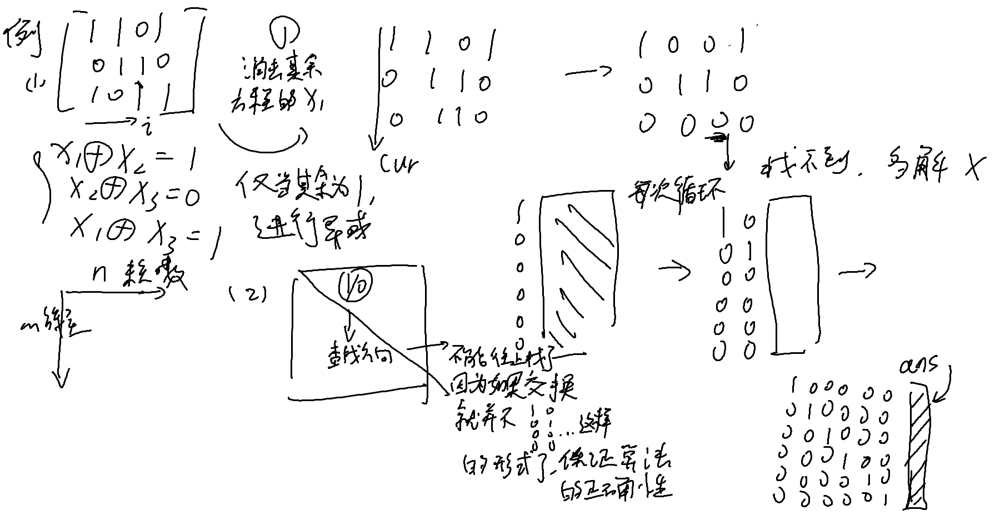

## 高斯消元
### 消元法及高斯消元法思想
定义
1. 方程组中的一方程的未知数用含有另一未知数的代数式表示，并将其带入到另一方程中
2. 或将方程组中的一方程倍乘某个常数加到另外一方程中去

主要用于二元一次方程组的求解
### 消元法理论的核心
- 两方程互换，解不变；
- 一方程乘以非零数 k，解不变；
- 一方程乘以数 k 加上另一方程，解不变。

### 解异或方程组
$$\begin{cases}
a_{1,1}x_1 \oplus a_{1,2}x_2 \oplus \cdots \oplus a_{1,n}x_n &= b_1\\
a_{2,1}x_1 \oplus a_{2,2}x_2 \oplus \cdots \oplus a_{2,n}x_n &= b_2\\
\cdots &\cdots \\ a_{m,1}x_1 \oplus a_{m,2}x_2 \oplus \cdots \oplus a_{m,n}x_n &= b_1
\end{cases}$$

参考实现：
```c++
std::bitset<1010> matrix[2010];  // matrix[1~n]：增广矩阵，0 位置为常数

std::vector<bool> GaussElimination(
    int n, int m)  // n 为未知数个数，m 为方程个数，返回方程组的解
                   // （多解 / 无解返回一个空的 vector）
{
  for (int i = 1; i <= n; i++) {
    int cur = i;
    while (cur <= m && !matrix[cur].test(i)) cur++;//当前行xi找到第一个不为0的行
    if (cur > m) return std::vector<bool>(0);//找不到肯定无解
    if (cur != i) swap(matrix[cur], matrix[i]);//如果i和cur不同交换一下，这样第i列就是xi的解了
    for (int j = 1; j <= m; j++)
      if (i != j && matrix[j].test(i)) matrix[j] ^= matrix[i];//其他行的系数前面如果是1的话就消掉变成0
  }
  std::vector<bool> ans(n + 1);
  for (int i = 1; i <= n; i++) ans[i] = matrix[i].test(0);//0 位置为常数
  return ans;
}
```
1. **数据结构**  
   - `matrix[1~m]` 是增广矩阵，每个 `bitset` 表示一个方程。
   - `bitset` 的第 **1~n 位** 是变量系数（1 表示存在，0 表示不存在），第 **0 位** 是常数项。

2. **核心步骤**  
   - **选主元**：对每个变量 \( x_i \)（列 `i`），找到第一个系数为 1 的行 `cur`。若找不到，说明该变量是自由变量（无唯一解），返回空向量。
   - **行交换**：将主元行交换到当前行 `i`。
   - **消元**：用主元行消去其他行中列 `i` 的系数（异或操作）。

3. **构造解**  
   - 消元完成后，若每个变量均有主元，则解的第 `i` 位取自主元行 `i` 的常数项（`matrix[i].test(0)`）。
