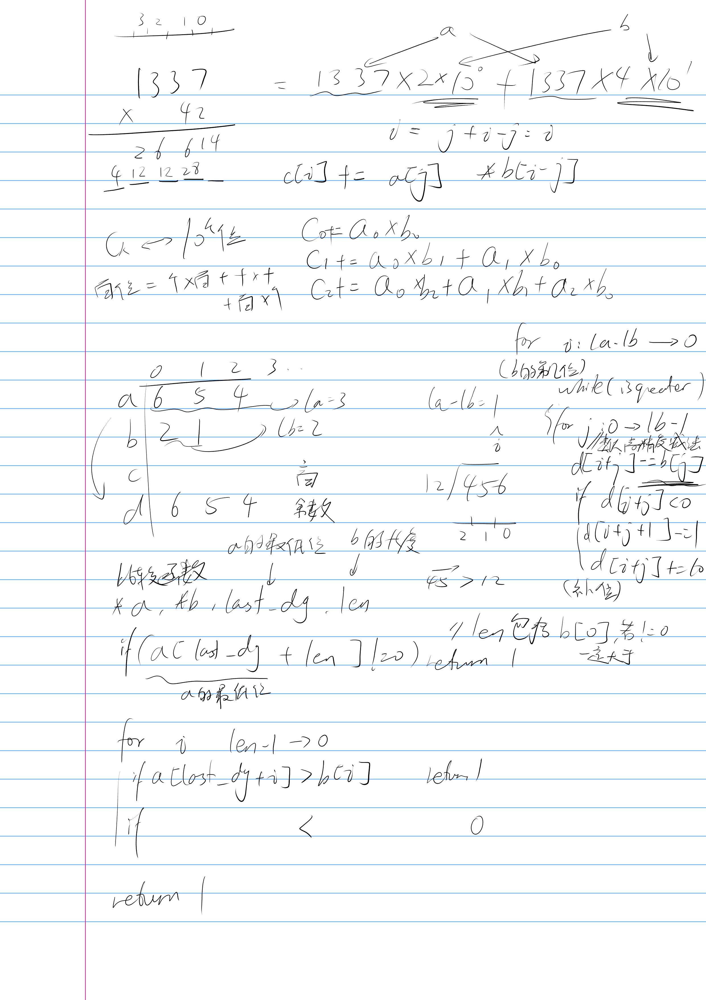

参见oiwki[高精度计算](https://oi-wiki.org/math/bignum/)

## 入门
数组的每个元素只存储一位
### 存储
```c++
void clear(int a[]) {
  for (int i = 0; i < LEN; ++i) a[i] = 0;
}

void read(int a[]) {
  static char s[LEN + 1];
  scanf("%s", s);

  clear(a);

  int len = strlen(s);
  // 如上所述，反转
  for (int i = 0; i < len; ++i) a[len - i - 1] = s[i] - '0';
  // s[i] - '0' 就是 s[i] 所表示的数码
  // 有些同学可能更习惯用 ord(s[i]) - ord('0') 的方式理解
}
```
### 加法
注意数组c不是直接赋值，而是`+=`操作，是因为可能有来自低位的进位
```c++
void add(int a[], int b[], int c[]) {
  clear(c);

  // 高精度实现中，一般令数组的最大长度 LEN 比可能的输入大一些
  // 然后略去末尾的几次循环，这样一来可以省去不少边界情况的处理
  // 因为实际输入不会超过 1000 位，故在此循环到 LEN - 1 = 1003 已经足够
  for (int i = 0; i < LEN - 1; ++i) {
    // 将相应位上的数码相加
    c[i] += a[i] + b[i];
    if (c[i] >= 10) {
      // 进位
      c[i + 1] += 1;
      c[i] -= 10;
    }
  }
}
```
### 减法
只能处理减数 $a$ 大于等于被减数 $b$ 的情况，$ a<b $时则算$b-a$再在前面加上负号即可
```c++
void sub(int a[], int b[], int c[]) {
  clear(c);

  for (int i = 0; i < LEN - 1; ++i) {
    // 逐位相减
    c[i] += a[i] - b[i];
    if (c[i] < 0) {
      // 借位
      c[i + 1] -= 1;
      c[i] += 10;
    }
  }
}
```
### 乘法
#### 高精度—单精度
```c++
void mul_short(int a[], int b, int c[]) {
  clear(c);

  for (int i = 0; i < LEN - 1; ++i) {
    // 直接把 a 的第 i 位数码乘以乘数，加入结果
    c[i] += a[i] * b;

    if (c[i] >= 10) {
      // 处理进位
      // c[i] / 10 即除法的商数成为进位的增量值
      c[i + 1] += c[i] / 10;
      // 而 c[i] % 10 即除法的余数成为在当前位留下的值
      c[i] %= 10;
    }
  }
}
```
#### 高精度—高精度

```c++
void mul(int a[], int b[], int c[]) {
  clear(c);

  for (int i = 0; i < LEN - 1; ++i) {
    // 这里直接计算结果中的从低到高第 i 位，且一并处理了进位
    // 第 i 次循环为 c[i] 加上了所有满足 p + q = i 的 a[p] 与 b[q] 的乘积之和
    // 这样做的效果和直接进行上图的运算最后求和是一样的，只是更加简短的一种实现方式
    for (int j = 0; j <= i; ++j) c[i] += a[j] * b[i - j];

    if (c[i] >= 10) {
      c[i + 1] += c[i] / 10;
      c[i] %= 10;
    }
  }
}
```
### 除法
```c++
// 被除数 a 以下标 last_dg 为最低位，是否可以再减去除数 b 而保持非负
// len 是除数 b 的长度，避免反复计算
bool greater_eq(int a[], int b[], int last_dg, int len) {
  // 有可能被除数剩余的部分比除数长，这个情况下最多多出 1 位，故如此判断即可
  if (a[last_dg + len] != 0) return true;
  // 从高位到低位，逐位比较
  for (int i = len - 1; i >= 0; --i) {
    if (a[last_dg + i] > b[i]) return true;
    if (a[last_dg + i] < b[i]) return false;
  }
  // 相等的情形下也是可行的
  return true;
}

void div(int a[], int b[], int c[], int d[]) {
  clear(c);
  clear(d);

  int la, lb;
  for (la = LEN - 1; la > 0; --la)
    if (a[la - 1] != 0) break;
  for (lb = LEN - 1; lb > 0; --lb)
    if (b[lb - 1] != 0) break;
  if (lb == 0) {  // 除数不能为零
    puts("> <");
    return;
  }

  // c 是商
  // d 是被除数的剩余部分，算法结束后自然成为余数
  for (int i = 0; i < la; ++i) d[i] = a[i];
  for (int i = la - lb; i >= 0; --i) {
    // 计算商的第 i 位
    while (greater_eq(d, b, i, lb)) {
      // 若可以减，则减
      // 这一段是一个高精度减法
      for (int j = 0; j < lb; ++j) {
        d[i + j] -= b[j];
        if (d[i + j] < 0) {
          d[i + j + 1] -= 1;
          d[i + j] += 10;
        }
      }
      // 使商的这一位增加 1
      c[i] += 1;
      // 返回循环开头，重新检查
    }
  }
}
```
