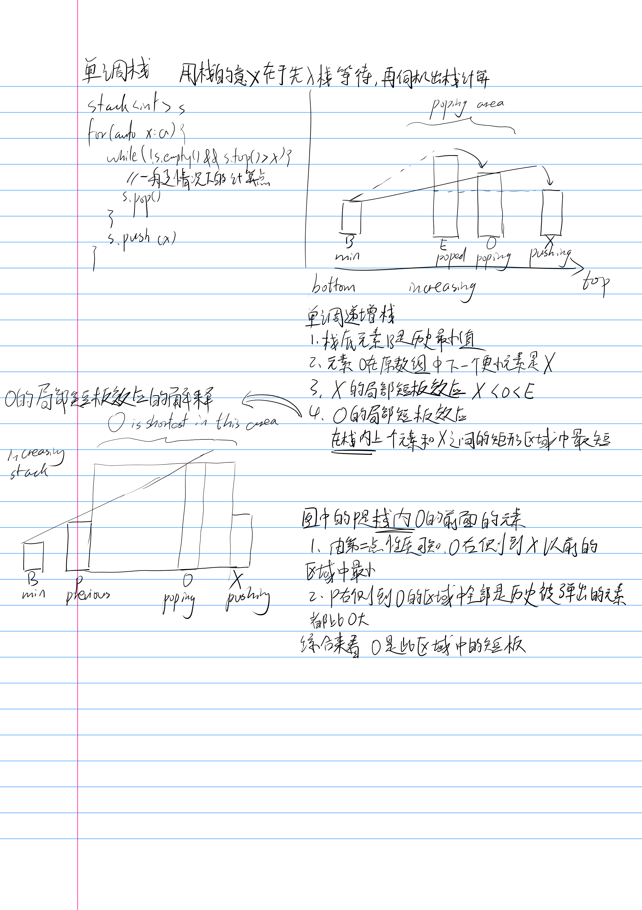

参考oiwiki上的[单调栈](https://oi-wiki.org/ds/monotonous-stack/)
[单调栈的性质 和 题目总结|春水煎茶 · 王超的个人博客](https://writings.sh/post/monotonic-stack)

满足单调的性质的栈

实现
```
insert x
while !sta.empty() && sta.top()<x
    sta.pop()
sta.push(x)
```
