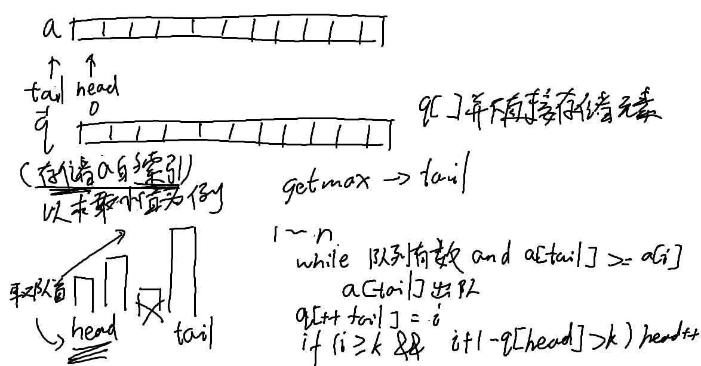

oiwiki[单调队列](https://oi-wiki.org/ds/monotonous-queue/)

例题
>[Sliding Window](http://poj.org/problem?id=2823)
本题大意是给出一个长度为 $n$ 的数组，编程输出每 $k$ 个连续的数中的最大值和最小值。
>
>顾名思义，单调队列的重点分为「单调」和「队列」。
>「单调」指的是元素的「规律」——递增（或递减）。
>「队列」指的是元素只能从队头和队尾进行操作。
>Ps. 单调队列中的 "队列" 与正常的队列有一定的区别

```c++
#include <cstdlib>
#include <cstring>
#include <iostream>
constexpr int MAXN = 1000100;
using namespace std;
int q[MAXN], a[MAXN];
int n, k;

void getmin() {  // 得到这个队列里的最小值，直接找到最后的就行了
  int head = 0, tail = -1;
  for (int i = 1; i < k; i++) {
    while (head <= tail && a[q[tail]] >= a[i]) tail--;
    q[++tail] = i;
  }
  for (int i = k; i <= n; i++) {
    while (head <= tail && a[q[tail]] >= a[i]) tail--;
    q[++tail] = i;
    while (q[head] <= i - k) head++;
    cout << a[q[head]] << ' ';
  }
}

void getmax() {  // 和上面同理
  int head = 0, tail = -1;
  for (int i = 1; i < k; i++) {
    while (head <= tail && a[q[tail]] <= a[i]) tail--;
    q[++tail] = i;
  }
  for (int i = k; i <= n; i++) {
    while (head <= tail && a[q[tail]] <= a[i]) tail--;
    q[++tail] = i;
    while (q[head] <= i - k) head++;
    cout << a[q[head]] << ' ';
  }
}

int main() {
  cin.tie(nullptr)->sync_with_stdio(false);
  cin >> n >> k;
  for (int i = 1; i <= n; i++) cin >> a[i];
  getmin();
  cout << '\n';
  getmax();
  cout << '\n';
  return 0;
}
```


对于`getmin()`函数
```c++
void getmin() {  // 得到这个队列里的最小值，直接找到最后的就行了
  int head = 0, tail = -1;
  for (int i = 1; i < k; i++) {
    while (head <= tail && a[q[tail]] >= a[i]) tail--;
    q[++tail] = i;
  }
  for (int i = k; i <= n; i++) {
    while (head <= tail && a[q[tail]] >= a[i]) tail--;
    q[++tail] = i;
    while (q[head] <= i - k) head++;
    cout << a[q[head]] << ' ';
  }
}
```
我的理解：

* 1.为了保持后一个元素的加入后仍然保持单调，如果tail处的元素大于a[i]，将tail减少，保持严格单调递增
* 2.加入元素
* |3.左边越界的元素离开队列
* |4.所得到的a[q[head]]（即最左边的元素即为最小值）

3,4仅当k~n时候执行（从一开始索引
`head <= tail`表示窗口中有元素，是移动tail和head前置条件条件
同样是因为从一开始索引的缘故，`q[head] <= i - k`，上式其实等价于`k < i + 1 - q[head]`，因为q[head]表示的是窗口左边的索引，意即当窗口大小大于k时，将窗口的左边向右移动
 
这边得要逻辑清晰点，head，tail是数组q的索引，数组q存储的是数组a的索引，不要把上面`k < i + 1 - q[head]`不等式写成`k < tail + 1 - head`。首先对于更新窗口的左端，窗口的右端实际上是i，不要混淆i和tail，其次，q[head]才是数组a的索引，并不是head

在数组q，数组q的索引head和tail共同维护单调队列
最坏情况下数组a严格单调递增，故数组q的长度至少等于a的长度

长度[s,t]的单调队列
```c++
	vector<int> q(n + 1);
	int tail = -1, head = 0;
	for (int i = 1; i <= n - s; i++) {
		while (head <= tail && a[q[tail]] >= a[i])
			tail--;
		q[++tail] = i;

		while (head <= tail && i + s + 1 - q[head]> t)
			head++;
	}
  ```
  （以下都是a的索引）
  窗口最左端是q[head]
  窗口最右端是i + s
  队列最小q[head]
  队列最大q[tail]