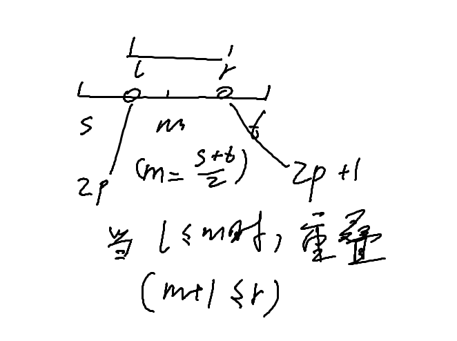

参考oiwiki上的[线段树](https://oi-wiki.org/ds/seg/)

与树状数组不同，线段树要是四倍原数组长，否则会存不下

建树
```c++
void build(int s, int t, int p) {
  // 对 [s,t] 区间建立线段树,当前根的编号为 p
  if (s == t) {
    d[p] = a[s];
    return;
  }
  int m = s + ((t - s) >> 1);
  // 移位运算符的优先级小于加减法，所以加上括号
  // 如果写成 (s + t) >> 1 可能会超出 int 范围
  build(s, m, p * 2), build(m + 1, t, p * 2 + 1);
  // 递归对左右区间建树
  d[p] = d[p * 2] + d[(p * 2) + 1];
}
```


存在懒节点表示子类未加

实现
接下来给出在存在标记的情况下，区间修改和查询操作的参考实现。

区间修改（区间加上某个值）：


```C++
// [l, r] 为修改区间, c 为被修改的元素的变化量, [s, t] 为当前节点包含的区间, p
// 为当前节点的编号
void update(int l, int r, int c, int s, int t, int p) {
  // 当前区间为修改区间的子集时直接修改当前节点的值,然后打标记,结束修改
  if (l <= s && t <= r) {
    d[p] += (t - s + 1) * c, b[p] += c;
    return;
  }
  int m = s + ((t - s) >> 1);
  if (b[p] && s != t) {
    // 如果当前节点的懒标记非空,则更新当前节点两个子节点的值和懒标记值
    d[p * 2] += b[p] * (m - s + 1), d[p * 2 + 1] += b[p] * (t - m);
    b[p * 2] += b[p], b[p * 2 + 1] += b[p];  // 将标记下传给子节点
    b[p] = 0;                                // 清空当前节点的标记
  }
  if (l <= m) update(l, r, c, s, m, p * 2);
  if (r > m) update(l, r, c, m + 1, t, p * 2 + 1);
  d[p] = d[p * 2] + d[p * 2 + 1];
}
```
区间查询（区间求和）：


```C++
int getsum(int l, int r, int s, int t, int p) {
  // [l, r] 为查询区间, [s, t] 为当前节点包含的区间, p 为当前节点的编号
  if (l <= s && t <= r) return d[p];
  // 当前区间为询问区间的子集时直接返回当前区间的和
  int m = s + ((t - s) >> 1);
  if (b[p]) {
    // 如果当前节点的懒标记非空,则更新当前节点两个子节点的值和懒标记值
    d[p * 2] += b[p] * (m - s + 1), d[p * 2 + 1] += b[p] * (t - m);
    b[p * 2] += b[p], b[p * 2 + 1] += b[p];  // 将标记下传给子节点
    b[p] = 0;                                // 清空当前节点的标记
  }
  int sum = 0;
  if (l <= m) sum = getsum(l, r, s, m, p * 2);
  if (r > m) sum += getsum(l, r, m + 1, t, p * 2 + 1);
  return sum;
}
```