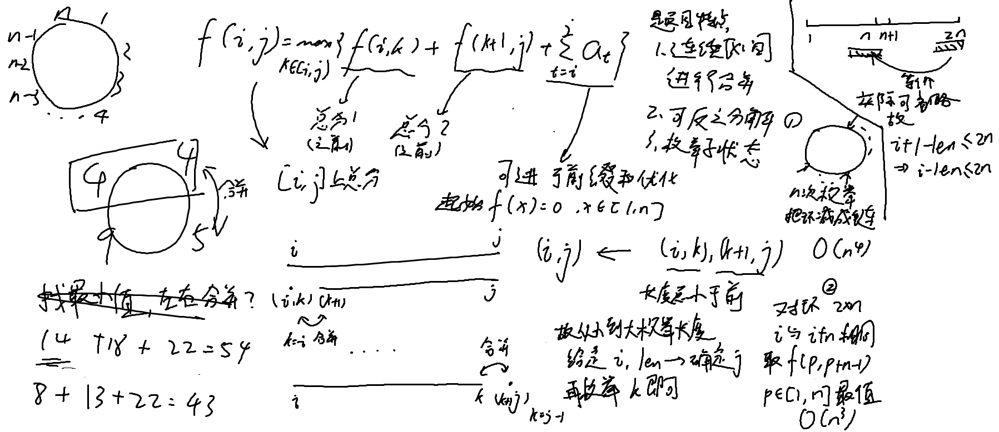

[#10147. 「一本通 5.1 例 1」石子合并](https://loj.ac/p/10147)


在oiwiki上面补的知识点，环形合并石头子的问题

先考虑为链的情况，初始状态可以设$f(a,b)=0,a,b\in [1,n]$且$a\leq b$。然后对于$f[i,j]$，则有$f[i,j]= \max\limits_{k\in[i,j)}\{f[i,k]+f[k+1,j]+cost\}$，每次分数都在$f(i,j)$里面，最后求$f(1,n)$即为$[1,n]$的最大值

因为对于$f[i,j]$，其更新依赖的$f[i,k]$和$f[k+1,j]$长度都小于$f[i,j]$，故可以枚举len，从2到n

对于环形的情况把数组长度扩充到2\*n，然后2\*n取最大值/最小值即可

顺带一提为什么`i <= n * 2 - len`也能AC，详见图的右上角，因为是环形，所以实际上最后一种情况`i == n * 2 - len + 1`实际上是会与前面重合的，所以没必要处理最后一种状态（这个我问ds他还说要修正，LLM还是思维能力欠佳

之前还在想为什么会输出负数，原来是求前缀和的条件写错了，只写了`i <= n`，难怪

欸等等，是不是题目"$ 1\le n \le 200$”，当n>102的时候应该会RE才对啊，竟然AC了，这题目骗我是吧（x）（是你自己没注意又歪打正着了

还有注意输出是`f[i][i + n - 1]`，不要写成`f[i][i + n]`了

AC
```c++
#include<iostream>
#include<vector>
#include<algorithm>
#include<iomanip>
#include<cmath>
#include<string>
#include<iomanip>
#include<set>
#include<map>

using namespace std;

const int MAXN = 2e2 + 5;
int a[MAXN];
int pre[MAXN];
int max_score[MAXN][MAXN];
int min_score[MAXN][MAXN];
int ans_max, ans_min = 0x3f3f3f3f;

int main() {
	int n;
	cin >> n;
	for (int i = 1; i <= n; i++) {
		int x;
		cin >> x;
		a[i] = a[i + n] = x;
	}

	for (int i = 1; i <= 2 * n; i++) {//这边也要i <= 2 * n，要不然计算会出现错误
		pre[i] = pre[i - 1] + a[i];
	}

	for (int len = 2; len <= n; len++) {
		//for (int i = 1; i <= n; i++) {
		for (int i = 1; i <= n * 2 - len; i++) {
			int j = i - 1 + len;
			set<int> max_s;
			set<int> min_s;

			for (int k = i; k < j; k++) {
				max_s.insert(max_score[i][k] + max_score[k + 1][j] + pre[j] - pre[i - 1]);
				min_s.insert(min_score[i][k] + min_score[k + 1][j] + pre[j] - pre[i - 1]);
			}
			max_score[i][j] = *max_s.rbegin();
			min_score[i][j] = *min_s.begin();
		}
	}
	
	for (int i = 1; i <= n; i++) {
		ans_max = max(ans_max, max_score[i][i + n - 1]);
		ans_min = min(ans_min, min_score[i][i + n - 1]);
	}
	cout << ans_min << endl << ans_max;
}
```
