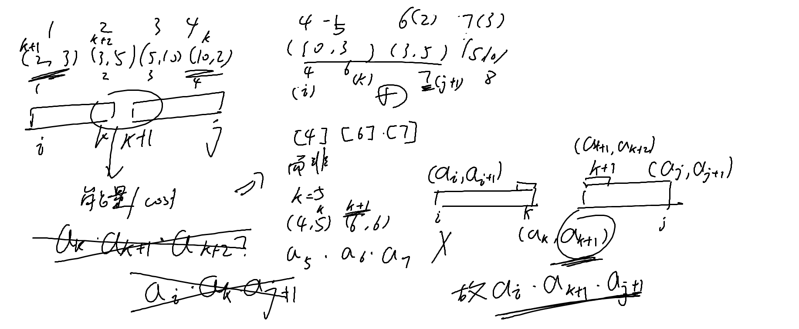

[P1063 [NOIP 2006 提高组] 能量项链](https://www.luogu.com.cn/problem/P1063)
难度
普及+/提高


这题目其实很简单，但是oiwiki上面看的是vijos里面的，没看到那个条件，所以还是有点做不出来（别摁找借口）。总之就是递推式中的$a_i\times a_{k+1} \times a_{j+1}$中间的写成了$a_i$，忍不住看了一眼题解改了一下就ac了

其实我这里的`set`可以直接优化为`[i][j] = max([i][j] , f[i][k] + f[k + 1][j] + a[i] * a[j + 1] * a[k + 1] );`，复杂度从$O(n\log n)$优化为线性时间

AC
```c++
#include<iostream>
#include<vector>
#include<algorithm>
#include<iomanip>
#include<cmath>
#include<string>
#include<iomanip>
#include<set>
#include<map>

using namespace std;

const int MAXN = 2e2 + 5;
int a[MAXN];
int f[MAXN][MAXN];

int main() {
	int n;
	cin >> n;

	for (int i = 1; i <= n; i++) {
		int x;
		cin >> x;
		a[i] = a[i + n] = x;
	}
	

	for (int len = 2; len <= n; len++) {
		for (int i = 1; i + len <= 2 * n; i++) {
			int j = i - 1 + len;
			set<int> max_set;

			for (int k = i; k < j; k++) {
				max_set.insert(f[i][k] + f[k + 1][j] + a[i] * a[j + 1] * a[k + 1]);
			}

			f[i][j] = *max_set.rbegin();
		}
	}
	
	int max_ans = 0;
	for (int i = 1; i <= n; i++) {
		max_ans = max(max_ans, f[i][i + n - 1]);
	}
	cout << max_ans;
}
```
