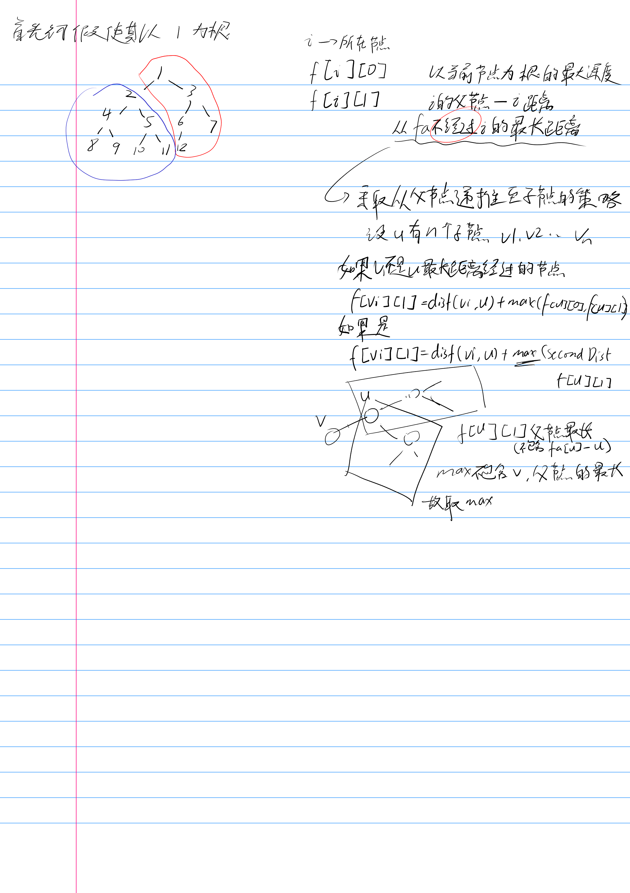

[原题链接](https://acm.hdu.edu.cn/showproblem.php?pid=2196)

也参考一下[这篇题解](https://blog.csdn.net/shuangde800/article/details/9732825)
思路写在纸上了（确定是纸？

草，还有个智障的地方是我没注意到他有多组测试样例，没重置`graph`绝了
AC
```c++
#include<iostream>
#include<vector>
#include<algorithm>
#include<iomanip>
#include<cmath>
#include<set>
#include<deque>
#include<cstring>
#include<map>

using namespace std;

typedef long long ll;

struct Node {
	int v, w;
};
constexpr int MAXN = 1e4 + 5;
int n;
vector<Node> graph[MAXN];
int dp[MAXN][2];
int vis[MAXN];

int dfs1(int u) {
	vis[u] = 1;
	dp[u][0] = 0;
	for (auto& node : graph[u]) {
		int v = node.v;
		int w = node.w;
		if (vis[v])continue;
		dp[u][0] = max(dp[u][0], dfs1(v) + w);
	}
	return dp[u][0];
}


void dfs2(int u, int fa) {
	vis[u] = 1;
	int max1 = 0, max2 = 0, v1 = -1;

	for (auto& node : graph[u]) {
		int v = node.v;
		int w = node.w;
		if (v == fa) continue;//跳过父节点
		int tmp = dp[v][0] + w;
		if (tmp > max1) {
			max2 = max1;
			max1 = tmp;
			v1 = v;
		}
		else if (tmp > max2) {
			max2 = tmp;
		}
	}

	for (auto& node : graph[u]) {
		int v = node.v;
		int w = node.w;
		if (v == fa) continue;

		//max是u不经过v的最长路径（搜寻了所有子节点得到的结果），同时也得取dp[u][1]找到对于u的父节点的最长路径
		if (v == v1) {
			dp[v][1] = max(dp[u][1], max2) + w;
		}
		else {
			dp[v][1] = max(dp[u][1], max1) + w;
		}
		dfs2(v, u);
	}
}

int main() {
	while (cin >> n) {
		for (int i = 1; i <= n; i++) {
			graph[i].clear();
		}

		for (int u = 2; u <= n; u++) {
			int v, w;
			cin >> v >> w;
			graph[u].push_back({ v,w });
			graph[v].push_back({ u,w });
		}
		memset(dp, 0, sizeof(dp));
		memset(vis, 0, sizeof(vis));
		dfs1(1);
		memset(vis, 0, sizeof(vis));
		dfs2(1, -1);

		for (int i = 1; i <= n; i++) {
			cout << max(dp[i][0], dp[i][1]) << endl;
		}


	}
}
```
