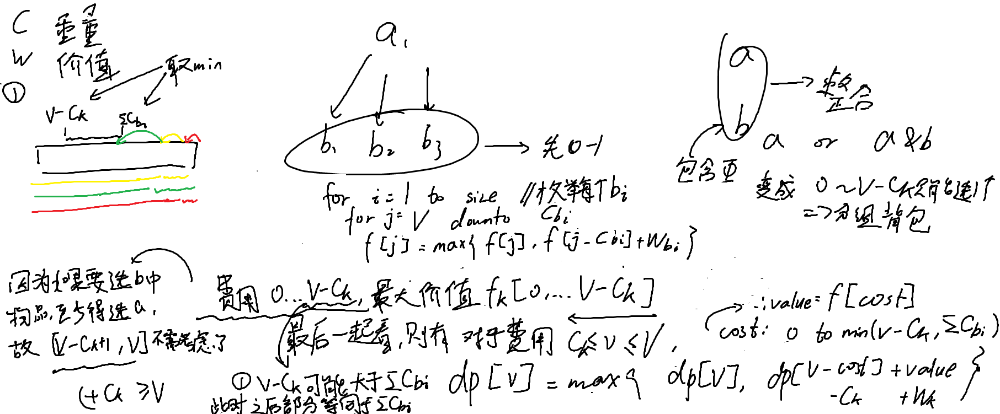

[P1064 [NOIP 2006 提高组] 金明的预算方案](https://www.luogu.com.cn/problem/P1064)
难度
普及+/提高

wc这题有点坐牢的，如果是临场那我可能就枚举一下了，但是还是按照背包九讲的方法来做，最后整了两个小时多（x



把每个依赖的组看成一个组，变成分组背包的形式，一开始并没发现什么端倪，输出了1.9e10的数字，因为是开在main函数外面还真读到数据了

然后把第二段的dp的`i - items[0].w`的`i`写成`n`了，原来数组越界了

改了之后出乎意料的TLE了

其中这个for循环其实是可以优化为基于范围的for循环，这样就可以只找到离散的元素了

还有一个要优化的点就是可能$V - C_k > \Sigma C_{b_i}$，注释写在左上脚了，中间那段其实是重复的，完全可以优化，cost（在后面的代码写的是j）取到二者的最小值即可，如果再大一点其实是浪费时间的（找到更小的空间，但是价值不变实际上无意义）

第一段的dp（或者说每个组求最大价值的dp）其实也是可以优化，因为cost（j）只能取到`max_j`，但是优化了还是TLE，最主要的浪费时间还是下面那一段

最后还有乱序的hack数据，例如
```
100 3
1000 5 3
10 5 3
50 2 0
```
这一组，这个时候就要用q判断数组的第一个元素是否是主件物品，如果不是，找到主件物品swap交换二者了，最后终于AC

AC
```c++
#include<iostream>
#include<vector>
#include<algorithm>
#include<iomanip>
#include<cmath>
#include<string>
#include<iomanip>
#include<set>
#include<map>

using namespace std;
const int MAXN = 3.2e4 + 5;
int m, n;
int dp[MAXN];
int v, p, q;
struct item {
	int w, v, q;
};
map<int, vector<item>> ma;
int f[MAXN];

int main() {
	cin >> n >> m;
	for (int k = 1; k <= m; k++) {
		cin >> v >> p >> q;
		item t;
		t.w = v;
		t.v = p * v;
		t.q = q;
		if (q == 0)
			ma[k].push_back(t);
		else
			ma[q].push_back(t);
	}
	for (auto& group : ma) {//基于范围的for
		int k = group.first;
		vector<item>& items = group.second;
		
		if (items[0].q != 0) {//处理乱序的hack数据
			for (auto& t : items) {
				if (t.q == 0) {
					swap(items[0], t);
				}
			}
		}

		fill(f, f + MAXN, 0);
		int sum_att = 0;
		for (int i = 1; i < items.size(); ++i) {
			int att_w = items[i].w;
			sum_att += att_w;
			for (int j = n; j >= att_w; --j) {
				f[j] = max(f[j], f[j - att_w] + items[i].v);
			}
		}

		for (int i = n; i >= items[0].w; --i) {
			int max_j = min(i - items[0].w, sum_att);//取二者的最小值
			for (int j = 0; j <= max_j; ++j) {
				if (i >= items[0].w + j) {
					dp[i] = max(dp[i], dp[i - (items[0].w + j)] + items[0].v + f[j]);
				}
			}
		}
	}
	cout << dp[n];
}
```