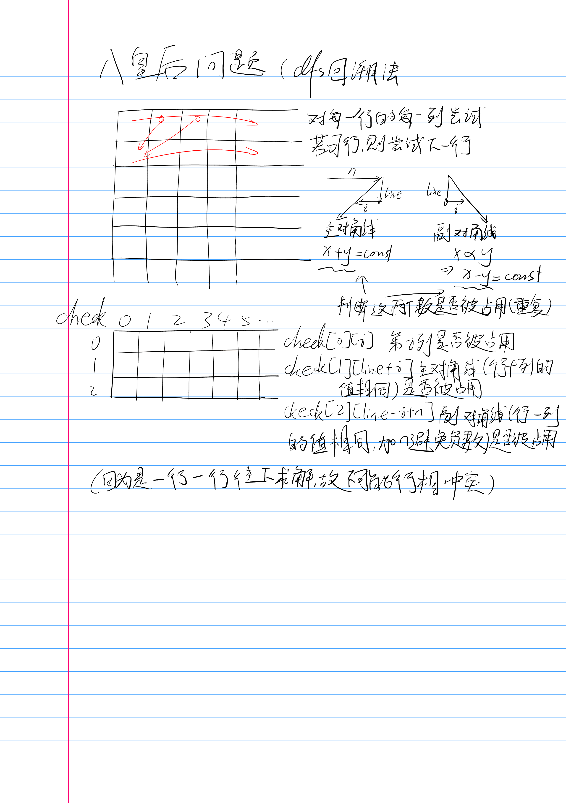

[P1219 [USACO1.5] 八皇后 Checker Challenge](https://www.luogu.com.cn/problem/P1219)
难度
普及/提高−


（还是感谢d指导，oiwiki上面没仔细讲check数组的作用

还有我也是神人了，`int i = 1; i <= n; i++`的条件写成`1 <= n`，然后一直停不下来了，一直RE

AC
```c++
#include<iostream>
#include<vector>
#include<algorithm>
#include<iomanip>
#include<cmath>
#include<set>

using namespace std;
int n, ans[14], check[3][28], sum;

void dfs(int line) {
	if (line > n) {
		sum++;
		if (sum > 3) {
			return;
		}
		else {
			for (int i = 1; i <= n; i++)
				cout << ans[i] << ' ';
			cout << endl;
			return;
		}
	}
	for (int i = 1; i <= n; i++) {
		auto& a = check[0][i];
		auto& b = check[1][line + i];
		auto& c = check[2][line - i + n];
		if (!a && !b && !c) {
			ans[line] = i;
			a = 1;
			b = 1;
			c = 1;
			dfs(line + 1);
			a = 0;
			b = 0;
			c = 0;
		}
	}
}

int main() {
	cin.tie(0)->sync_with_stdio(false);
	cin >> n;
	dfs(1);
	cout << sum;
}
```
