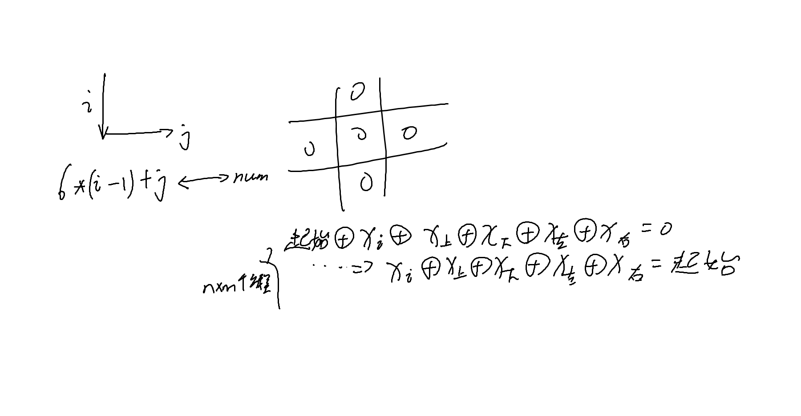

[2811:熄灯问题](http://bailian.openjudge.cn/practice/2811/)


也可以参考这篇笔记[小游戏 Lights Out (关灯) 的求解 —— 异或方程组](https://www.cnblogs.com/JoeFan/p/4338003.html)
这个题目要用高斯消元的知识，求解异或方程组，可以参考一下我笔记高斯消元解异或方程组这个算法怎么运行的。

对于每个点$(i,j)$，其的状态取决于**初始状态**与**当前点是否按**与**上下左右的点是否按**共同决定。因按两下或者不按等于0，只按一下等于1，所以可以转化成异或方程组。对其进行高斯消元即可。设起始状态为M，是否按为S，则为$M_i$ xor $S_i$ xor $S_{\Sigma ki}=0$，把$M_i$移到右边化为标准形式，未知数即$S_i$，上述状态等价于$S_i$ xor $S_{\Sigma ki}$=$M_i$，一共有`COL*ROW`个方程组，共`COL*ROW`个未知数

AC
```c++
#include<iostream>
#include<vector>
#include<algorithm>
#include<iomanip>
#include<cmath>
#include<string>
#include<iomanip>
#include<set>
#include<map>
#include<bitset>

using namespace std;

const int COL = 6;
const int ROW = 5;

bitset<40> matrix[40];
bool table[10][10];

int get_num(int i, int j) {
	return COL * (i - 1) + j;
}

vector<bool> GauseXOR(int n, int m){//n未知数，m方程，位置0保存常数
	for (int i = 1; i <= n; i++) {
		int cur = i;
		while (cur <= m && !matrix[cur].test(i))cur++;//找到cur行，其i位为真
		if (cur > m)return vector<bool>(0);
		if (i != cur)swap(matrix[i], matrix[cur]);//不同则交换
		for (int j = 1; j <= m; j++)
			if (i != j && matrix[j].test(i))matrix[j] ^= matrix[i];//消掉其他位的真
	}
	vector<bool> ans(n + 1);
	for (int i = 1; i <= n; i++) {
		ans[i] = matrix[i].test(0);
	}
	return ans;
}

int main() {

	for (int i = 1; i <= ROW; i++) {
		for (int j = 1; j <= COL; j++) {
			cin >> table[i][j];
		}
	}

	for (int i = 1; i <= ROW; i++) {
		for (int j = 1; j <= COL; j++) {
			auto& ma = matrix[get_num(i, j)];
			ma.set(get_num(i, j));
			if (i > 1)ma.set(get_num(i - 1, j));
			if (i < 5)ma.set(get_num(i + 1, j));
			if (j > 1)ma.set(get_num(i, j - 1));
			if (j < 6)ma.set(get_num(i, j + 1));
			if (table[i][j])
				ma.set(0);
		}
	}

	int total = COL * ROW;
	auto ans = GauseXOR(total, total);

	for (int i = 1; i <= ROW; i++) {
		for (int j = 1; j <= COL; j++) {
			cout << ans[get_num(i, j)] << ' ';
		}
		cout << endl;
	}
}
```