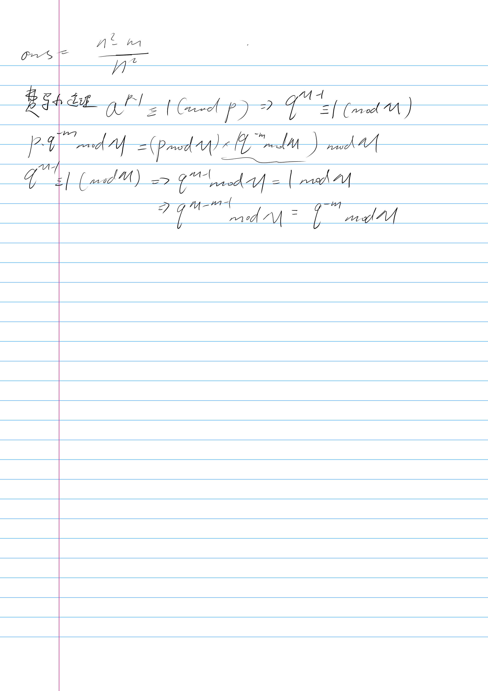

[Jxc军训](https://ac.nowcoder.com/acm/problem/15499)

wc这题完全就是数学题吧

还有用费马小定理的条件是`p`为质数，`gcd(a,p)=1`
AC
```c++
#include<iostream>
#include<vector>
#include<algorithm>
#include<iomanip>
#include<cmath>
#include<set>
#include<deque>
#include<cstring>
#include<map>

using namespace std;

typedef unsigned long long ull;
constexpr ull MOD = 998244353;

ull pow_mod(ull a, ull b, ull c) {
	a %= c;
	ull ans = 1;
	while (b > 0) {
		if (b & 1)
			ans = ans * a % c;
		a = a * a % MOD;
		b >>= 1;
	}
	return ans;
}

int main() {
	ull n, m;
	cin >> n >> m;
	ull p = n * n - m;
	ull q = n * n;
	cout << (p % MOD) * (pow_mod(q, MOD - 2, MOD) % MOD) % MOD;
}
```
