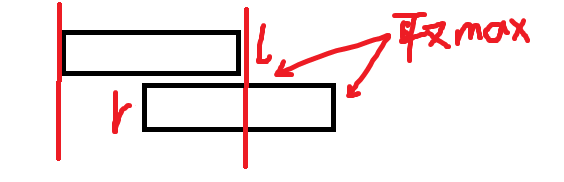

[P1496 火烧赤壁](https://www.luogu.com.cn/problem/P1496)
难度
普及−

思路：一开始我确实在想合并的问题，但是没有思路，问了gpt说可以**先按照大小排序再进行合并**。写代码的时候起初用的是vector，想到要合并就想到元素的删除，最后按照second-first求和。而链表可以常数个时间删除，于是就有了下面的代码

WA 30/100
```c++
#include<iostream>
#include<vector>
#include<cmath>
#include<iomanip>
#include<algorithm>
#include<list>

using namespace std;

bool cmp(pair<int, int>& p1, pair<int, int>& p2) {
	return p1.first < p2.first;
}

int main() {

	int n;
	cin >> n;
	list<pair<int, int>> l(n);
	for (auto& x : l) {
		cin >> x.first >> x.second;
	}

	l.sort(cmp);//排序合并
	auto p_b = l.begin();
	while (1) {
		if (p_b == prev(l.end()))//每次都取end，保存的end可能会失效
			break;
		auto p_next = next(p_b);
		if ((*p_b).second >= (*p_next).first) {
			(*p_b).second = (*p_next).second;
			l.erase(p_next);
		}
		else {
			p_b++;
		}

	}
	int total = 0;
	for (auto& x : l) {
		total += x.second - x.first;
	}
	cout << total;

}
```

结果出错了，问了gpt才发现直接直接一边合并一边求和，结果还是
WA 30/100
```c++
#include<iostream>
#include<vector>
#include<cmath>
#include<iomanip>
#include<algorithm>
#include<list>

using namespace std;

bool cmp(pair<int, int>& p1, pair<int, int>& p2) {
	return p1.first < p2.first;
}

int main() {

	int n;
	cin >> n;
	vector<pair<int, int>> v(n);
	for (auto& x : v) {
		cin >> x.first >> x.second;
	}

	sort(v.begin(), v.end(), cmp);

	int total = 0;
	for (int i = 0; i < n - 1; i++) {
		int l = v[i].second;
		int r = v[i + 1].first;
		if (l >= r) {
			total += r - v[i].first;
		}
		else {
			total += l - v[i].first;
		}
	}
	total += v[n - 1].second - v[n - 1].first;
	cout << total;

}
```

结果对于完全包含的区间会出错，就像这样
```
3
1 10
2 5
6 9
```
在判断`l>=r`的代码块里面加一行`v[i + 1].second = max(v[i + 1].second, l);`就AC了

一开始gpt给的是类似于"最大子数组"问题的那种动态规划解法，把区间合并问题转换为连续区间问题


不管怎么样解法，都得注意区间合并
```c++
	int total = 0;
	int conti_f = v[0].first;
	int conti_l = v[0].second;
	for (int i = 1; i < n; i++) {
		int n_f = v[i].first;
		int n_l = v[i].second;
		if (n_f > conti_l) {//断了
			total += conti_l - conti_f;
			conti_f = n_f;
			conti_l = n_l;
		}
		else {//重合了
			conti_l = max(conti_l, n_l);
		}
	}
	total += conti_l - conti_f;
	cout << total;
```