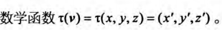  
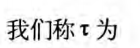  
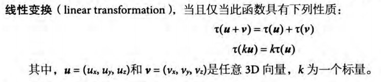  

## 矩阵表示法
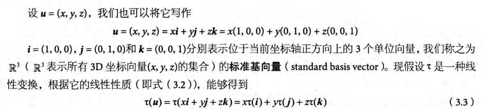  
线性组合可以改写为：
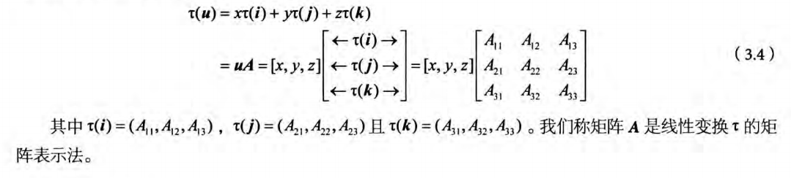  

## 缩放
  
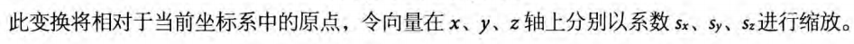  
  
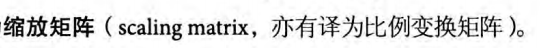  
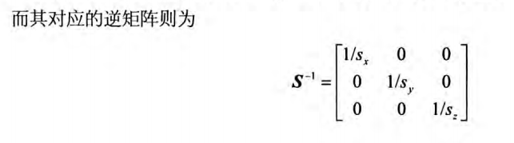  

## 旋转
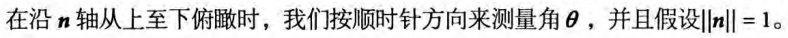  
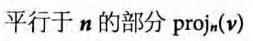  
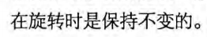  

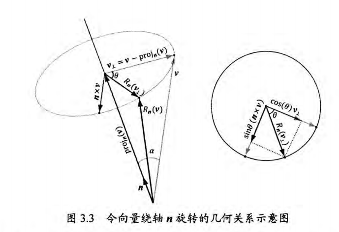  
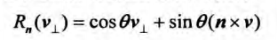  
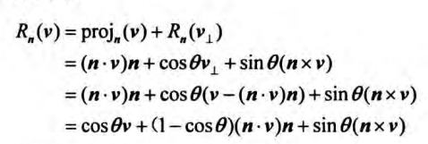  
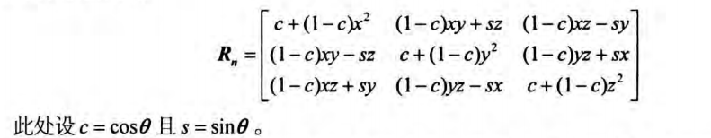  
**n**=(x,y,z)，且||**n**||=1

旋转矩阵为正交矩阵，即行向量都是规范正交的（互相正交且具有单位长度）
正交矩阵的特点：逆矩阵和转置矩阵相等

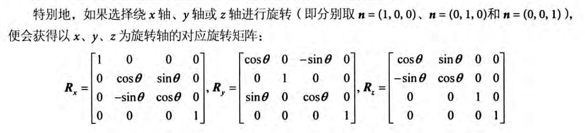  

## 齐次坐标
仿射变换（affine transformation）是由一个线性变换和一个平移变换组成的

齐次坐标（homogeneous coordinate）   
第四个坐标w的取值将根据被描述对象是点还是向量而定，具体来讲  
1.(x,y,z,0)表示向量  
2.(x,y,z,1)表示点  

## 放射变换的定义
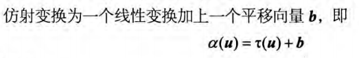  
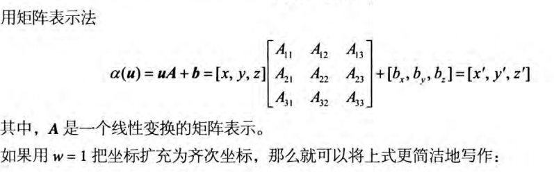  
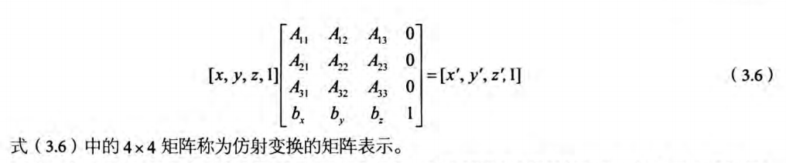  

向量的第四个分量w=0,它便不会受到向量**b**平移操作的影响  

## 平移
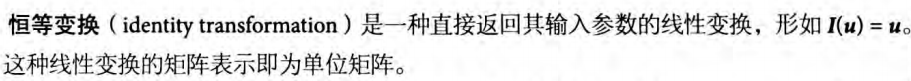  
将平移变换定义为仿射变换，此时线性变换就是一种恒等变换，即
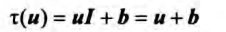  
即利用向量**b**对点**u**进行平移  
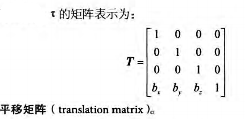  
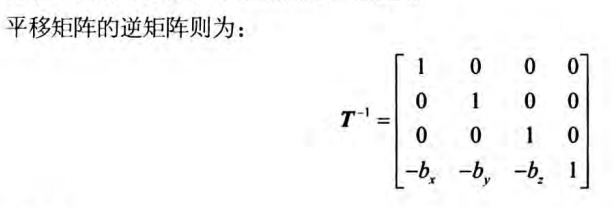  

逆矩阵能够“还原”变换操作  

## 缩放和旋转的仿射矩阵
如果**b** = **0**,则仿射变换将退化为线性变换，也就是说可以用**b** = **0**的仿射变换来表示任意线性变换
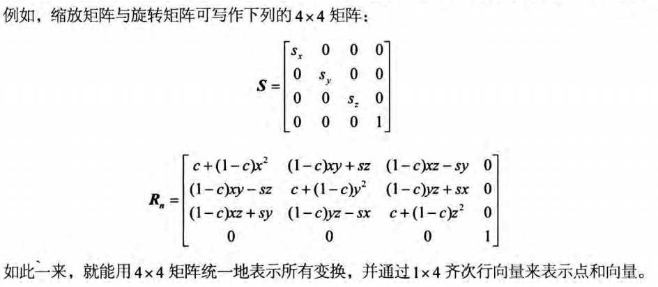  

## 仿射变换矩阵的几何意义
**刚体变换**（rigid body transformation），本质是一种保形（shape preserving）变换  
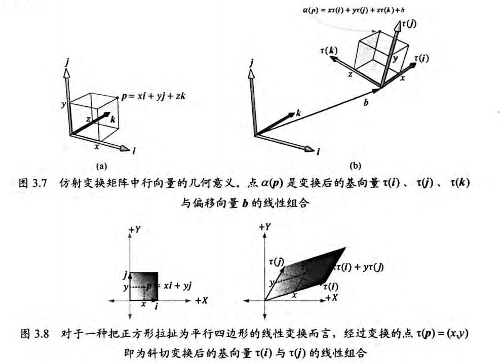  

## 变换的复合
由于矩阵乘法满足结合律，可以使得将不同的变换连接在一起  
矩阵之间的乘法运算不满足交换律

## 坐标系变换
不同标架间的坐标的转换称之为**坐标变换**（change of coordinate transformation）
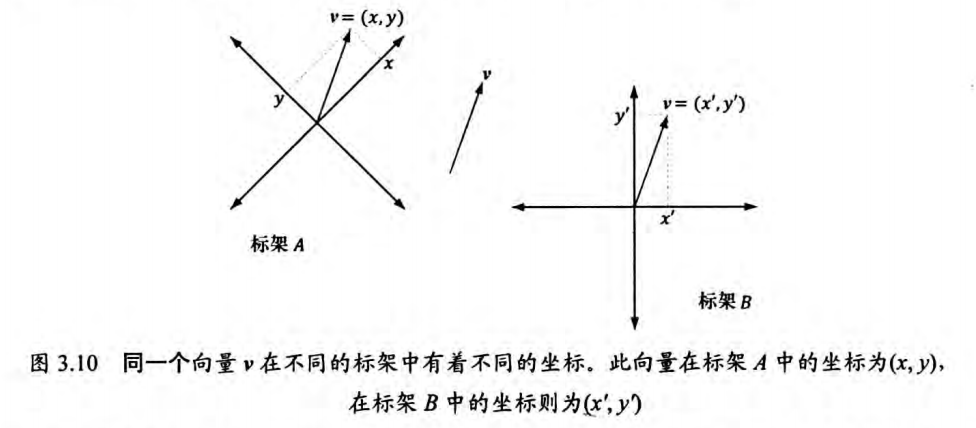  

## 向量的坐标变换
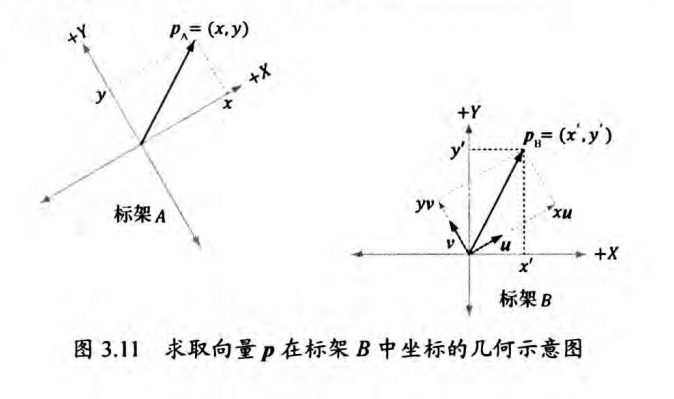  
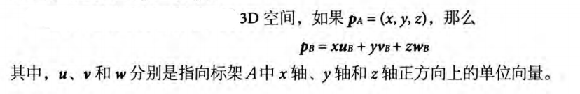  

## 点的坐标变换
位置是点的一个重要属性，因而不能将向量的方法直接用在点上 

可以将点**p**表示为  
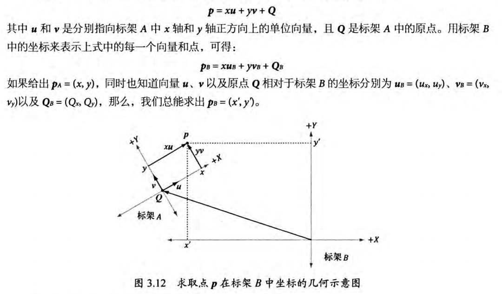  
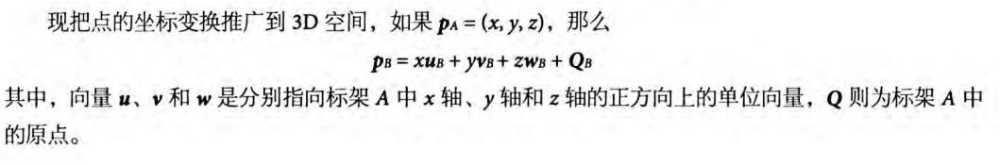  

## 坐标变换的矩阵表示
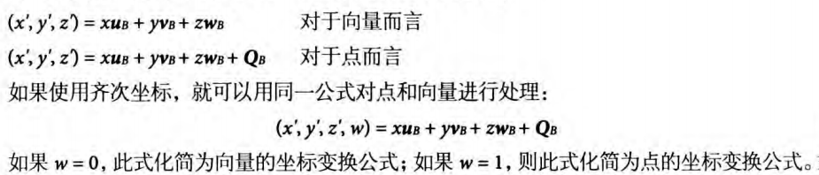  
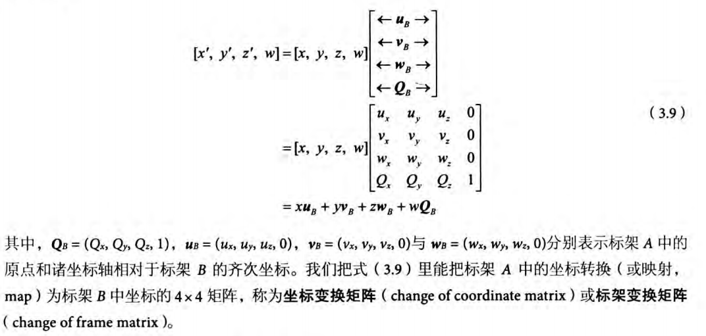  

## 坐标变换矩阵及其逆矩阵
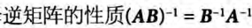  
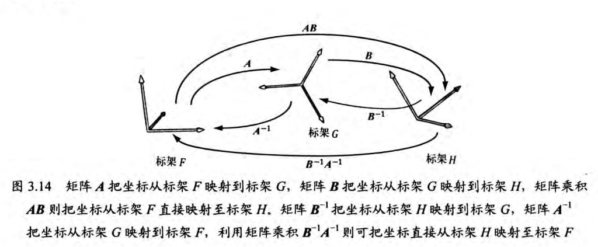  

## 变换矩阵与坐标变换矩阵
从数学角度上看，“使几何体本身发生改变”的变换（缩放、旋转和平移）与坐标变换二者在数学上是等价的，差别在解释变换的角度

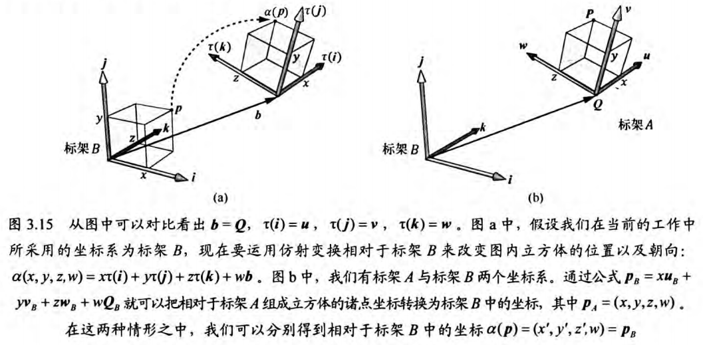  

## DirectXMath库提供的变换函数
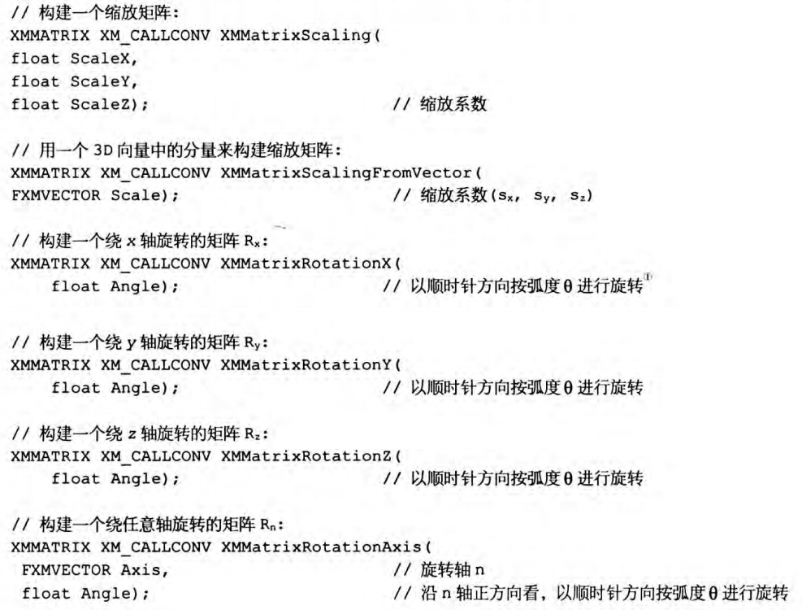  
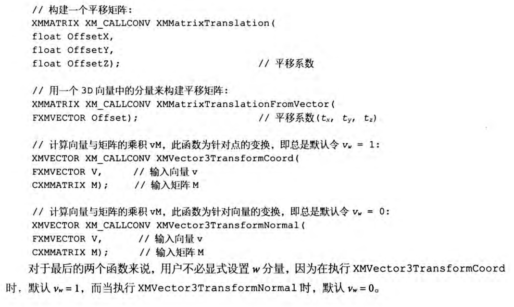  
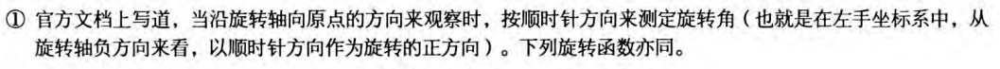  

对于[XMMatrixRotationAxis](https://learn.microsoft.com/en-us/windows/win32/api/directxmath/nf-directxmath-xmmatrixrotationaxis)，如果提供的旋转轴是规范化的函数执行将会更快
  
## 其他补充
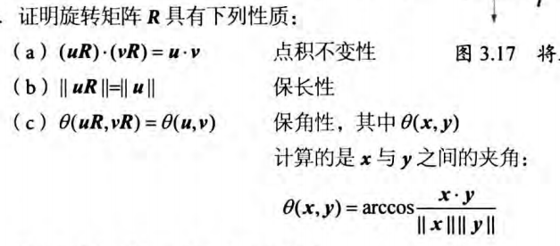  
直接缩放是相对原点的，会造成一定程度上的平移。对于立方体而言可以先求出中心点再将其平移至原点，缩放后再平移至原位置