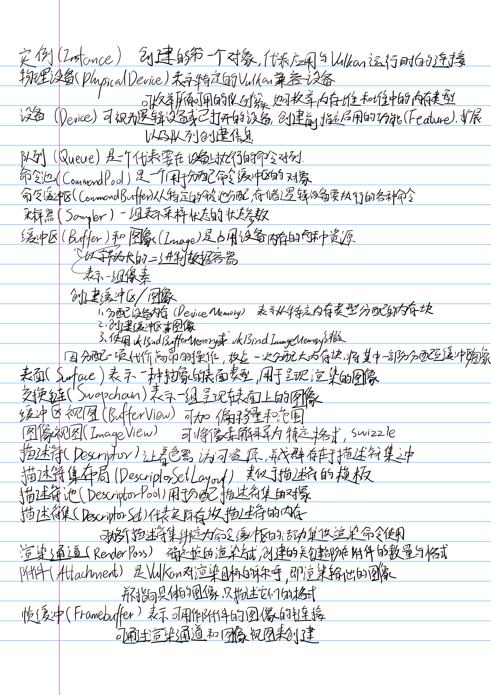
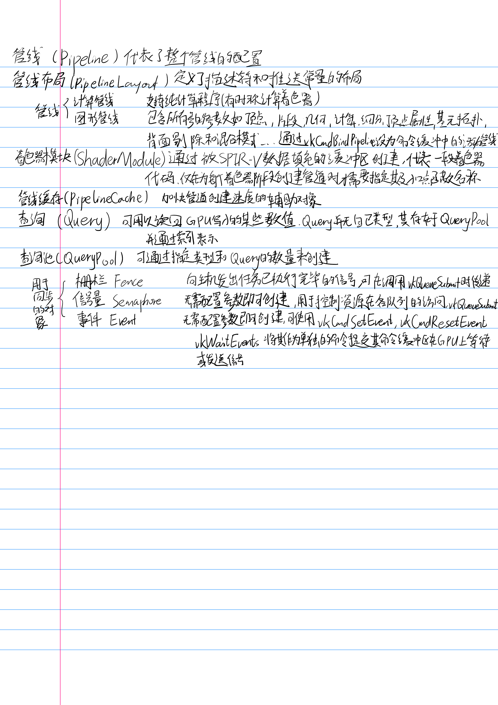

### Swizzling
通常指重新排列数据
保存的 RGBA->某些硬件更偏好的 BGRA或ARGB

应用
- 颜色通道的重新排列
- 纹理坐标转换
（`UV = (u, v)`到`WV = (w, v)`）
- 图像格式转换
（每个通道32位浮点数`RGBA32F`到每个通道无符号八位`BGRA8`）
### mipmap
为了加快渲染速度和减少图像锯齿，贴图被处理成由一系列被预先计算和优化过的图片组成的文件,这样的贴图被称为MIP map 或者mipmap
参考[Mipmap - wikipedia](https://zh.wikipedia.org/zh-cn/Mipmap)
[Mipmap详解(有无Mipmap区别、原理、优点、缺点、优化) - CSDN](https://blog.csdn.net/qq_42428486/article/details/118856697)
### 视图变换
可参考这篇文章[计算机图形学二：视图变换(坐标系转化，正交投影，透视投影，视口变换) —— 知乎](https://zhuanlan.zhihu.com/p/144329075)

模型变换->摄像机变换->投影变换->视口变换

[深入理解透视矩阵](https://www.zhyingkun.com/perspective/perspective/)

### 几个基本术语

[Understanding Vulkan® Objects](https://gpuopen.com/learn/understanding-vulkan-objects/)